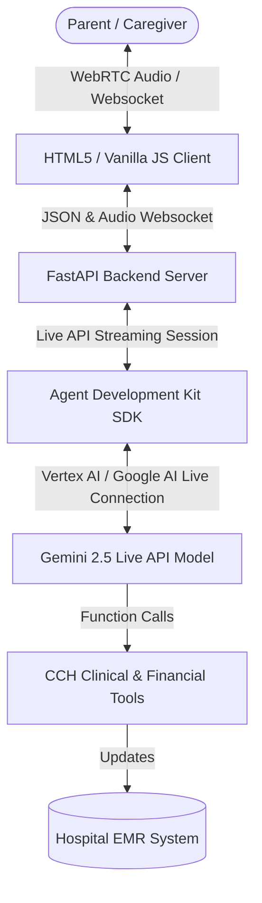

# 🏥 Cymbal Children's Hospital
## Home Care & Support Specialist Concierge Web Application — Documentation

This documentation provides a comprehensive guide to the **CCH Home Care & Support Specialist Concierge Web Application**. It details the application's purpose, underlying technology stack, operational architecture, user guidelines, supported languages, and a sample clinical dialogue.

---

## 1. 📋 What This Application Is About

The **CCH Home Care Concierge** is a real-time, low-latency, voice-and-text interactive clinical support system designed for the **Cymbal Children's Hospital (CCH)**. 

The application serves as a dedicated digital assistant representing the **"Home Care & Support Specialist"** role. Its primary objective is to assist parents, legal guardians, and primary caregivers of pediatric patients during their crucial transition from hospital discharge to home recovery—specifically focusing on children recovering from **Pediatric Asthma** and **Respiratory Syncytial Virus (RSV)**.

### Core Capabilities:
- **Discharge Paperwork Clarification:** Explains complex discharge documents, medication plans, and next steps for recovery in clear, supportive, and reassuring language.
- **Nurse Home Visits Coordination:** Looks up available clinical slots and books specialized pediatric nurse home care visits.
- **Financial Subsidy Management:** Evaluates, models, and applies government-sponsored funding subsidies (including **NDIS**, **Medicare**, or hospital assistance).
- **EMR Integration:** Automatically logs vitals, visit details, and approved support plans into the child's hospital Electronic Medical Record (EMR).

---

## 2. ⚙️ Underlying Technology & Architecture

The application is built upon a modern, high-performance, asynchronous real-time streaming architecture.

### 🧠 The Core Model
- **Primary Model:** `gemini-live-2.5-flash-native-audio` (Vertex AI) or `gemini-2.5-flash-native-audio-preview-12-2025` (Google AI Studio).
- **Native Audio Capability:** Unlike traditional LLMs that rely on separate Text-to-Speech (TTS) and Speech-to-Text (STT) cascading pipelines, Gemini 2.5 Live processes **audio input and generates audio output natively**. This dramatically reduces voice-to-voice latency down to sub-second conversational levels.

### 🛡️ Backend Stack
- **FastAPI (Python):** An asynchronous Python framework that hosts the static client assets and handles real-time WebSocket communication.
- **Google Agent Development Kit (ADK):** Orchestrates the Gemini Live connection, streaming context, session persistence, and native tool-calling routing.
- **Uvicorn:** A lightning-fast ASGI web server implementation.

### 💻 Frontend Client
- **HTML5 & Vanilla JavaScript:** Dynamic client-side application utilizing standard Web Audio APIs to record, chunk, and stream raw audio data over WebSockets, while synchronously playing back synthesized native audio received from the server.
- **Interactive Controls:** Features switches for **Proactivity** (allowing the agent to speak voluntarily) and **Affective Dialog** (enabling the agent to dynamically adapt its clinical tone to the caregiver's emotional state).

### 🛠️ Integrated Clinical Tools
The agent has access to 6 specialized Python tool definitions:
1. `get_home_care_cost_estimate(number_of_visits, service_type)`: Calculates pre-subsidy visit pricing (base rate of $150 AUD/visit).
2. `approve_funding_subsidy(subsidy_type, requested_rate)`: Verifies funding. *Note: Subsidy rates higher than 20% (0.20) are automatically flagged to require clinical supervisor approval.*
3. `apply_subsidy_to_support_plan(subsidy_type, approved_rate, support_plan_id)`: Registers approved rates.
4. `get_available_support_times(service_type)`: Queries the hospital database for open slots.
5. `schedule_home_care_visit(slot_id, child_name, parent_name)`: Locks in the clinical nurse booking.
6. `update_hospital_emr(child_name, booked_visits, approved_subsidies, clinical_notes)`: Commits interaction records to the hospital database.

---

## 3. 👥 How to Use This App & By Who

### Target Audience
- **Parents & Guardians:** Caregivers of pediatric patients (e.g., parents of young children recovering from respiratory illnesses like asthma/RSV) who need immediate, clinical, and reassuring support during home recovery.
- **Clinical Admin Staff:** Can use the interface to model home-care plans and schedule nurse visits alongside the family during discharge checkouts.

### Step-by-Step Usage Guidelines
1. **Prerequisites:** Ensure your web browser has permissions enabled for your **microphone**.
2. **Access the Portal:** Navigate to `http://localhost:7072` in your browser.
3. **Establish Connection:** Click the **Start Stream** button. You will see the connection status indicator turn green indicating "Connected".
4. **Communicate:** 
   - **Voice:** Speak naturally into your microphone (e.g., *"Can I get a nurse to come see Leo at home?"*).
   - **Text:** Alternatively, type your queries into the chat field at the bottom.
5. **Interactive Toggles:**
   - **Proactivity:** Check this to allow the clinical agent to initiate speaking turns without waiting for you to finish or click.
   - **Affective Dialog:** Check this to allow the agent to detect if you are stressed or anxious and dynamically adjust its speaking tone to be more clinical, soothing, and reassuring.

---

## 4. 🌍 Languages Supported

The application provides exceptional multilingual accessibility to support Melbourne’s highly diverse, multicultural population:

- **Primary Language:** **English (Australian)** — optimized with localized Melbournian clinical terminology, references to Australian healthcare systems (NDIS, Medicare), and emergency services (Healthdirect, 000).
- **Global Multilingual Support:** Because the backend is powered by Google Gemini, the agent can seamlessly detect and converse in **over 40 global languages**, including:
  - **Mandarin & Cantonese**
  - **Vietnamese**
  - **Arabic**
  - **Greek & Italian**
  - **Hindi & Punjabi**
  - **Spanish**

Caregivers can start talking in their native language, and the CCH Concierge will instantly adapt and respond in that same language, translating medical next steps dynamically.

---

## 5. 💬 Sample Dialogue

Here is a typical end-to-end clinical support interaction between **Sarah** (mother of 2-year-old **Leo**, who was just discharged following RSV recovery) and the **CCH Concierge Agent**:

| Sender | Input / Action | Agent Output / Tool Executed |
| :--- | :--- | :--- |
| **Sarah** | *(Anxious)* "Hi, Leo's breathing is a bit heavy, and I'm looking over these asthma discharge papers. I'm really overwhelmed. Can someone come check on him at home?" | "I understand completely, Sarah. It is incredibly common to feel overwhelmed, but you are doing a wonderful job. Let's arrange for a specialized pediatric home care nurse to visit Leo. First, let me check the available visit times for you." |
| **System** | *Automatic trigger* | 🛠️ **Calling `get_available_support_times()`**   ➡️ *Returns: Slots with Nurse Sarah (July 22, 09:00 AM) and Nurse Patrick (July 22, 01:30 PM)* |
| **Agent** | *Voice response* | "We have two open slots tomorrow, Wednesday, July 22nd. One is at 9:00 AM with Nurse Sarah, and another is at 1:30 PM with Nurse Patrick. Which of those works best for you?" |
| **Sarah** | "The morning slot at 9:00 AM is perfect. Is there a cost for this visit?" | "Great, let's book that 9:00 AM slot. Regarding the cost, the standard base rate is $150 AUD per specialized home visit. Let me officially book this for Leo first." |
| **System** | *Automatic trigger* | 🛠️ **Calling `schedule_home_care_visit(slot_id="slot_1", child_name="Leo", parent_name="Sarah")`**   ➡️ *Returns: Confirmed Booking `B-CCH-77812` with Nurse Sarah* |
| **Agent** | *Voice response* | "Leo's visit is officially confirmed with Nurse Sarah for tomorrow morning at 9:00 AM. Sarah will perform a full clinical breathing assessment, check his oxygen levels, and review Leo's inhaler spacer technique with you so you feel completely confident." |
| **Sarah** | "Thank you so much. Can we get NDIS or Medicare to cover some of that cost? We have a pediatric NDIS package." | "Absolutely. We can model and apply NDIS funding directly. I can approve a standard 15% hospital/NDIS funding subsidy immediately to help cover this cost. Let me process that for you." |
| **System** | *Automatic trigger* | 🛠️ **Calling `approve_funding_subsidy(subsidy_type="NDIS", requested_rate=0.15)`**   ➡️ *Returns: Approved=True*   🛠️ **Calling `apply_subsidy_to_support_plan(subsidy_type="NDIS", approved_rate=0.15)`**   ➡️ *Returns: Applied successfully to plan SP-CCH-9921* |
| **Agent** | *Voice response* | "Great news. I've approved and applied a 15% NDIS subsidy to Leo's home care plan. This reduces your out-of-pocket cost per visit. Let me log all of these details, our scheduled visit, and the approved subsidy into Leo's official CCH hospital EMR record so his clinical team is fully aligned." |
| **System** | *Automatic trigger* | 🛠️ **Calling `update_hospital_emr(child_name="Leo", booked_visits=["Confirmed Nurse Sarah July 22 9:00 AM"], approved_subsidies=[{"type": "NDIS", "rate": 0.15}], clinical_notes="Parent Sarah anxious. Home visit scheduled. 15% NDIS subsidy applied. Spacer review requested.")`**   ➡️ *Returns: EMR Update Success* |
| **Agent** | *Voice response* | "Everything is fully logged in Leo's medical file. Please remember, if you ever notice Leo having chest retractions, rapid breathing, or if you feel concerned before the nurse arrives, do not hesitate to present directly to our 24/7 CCH Emergency Department. You are doing a fantastic job, Sarah. We are with you every step of the way." |
