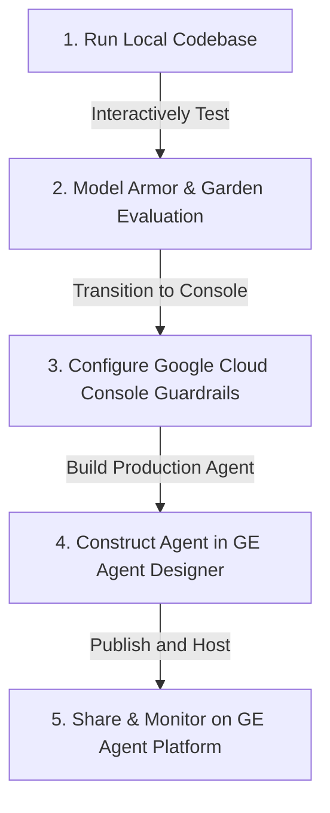

# Project Resume & Playbook: CSIRO Agent MVPs

This playbook outlines the logical path to run, test, and complete the four CSIRO Agent MVPs. It combines local codebase configuration with detailed console recipes for Google Cloud Platform (GCP) and the GE Agent Designer.

---

## 🗺️ Logical Flow of Tasks

To achieve the best results, proceed in this order:



---

## 🛠️ Step 1: Run the Local Web Dashboard (FastAPI + Glassmorphism SPA)

Antigravity has built a **unified, ultra-premium single-page web dashboard** served directly by the Enterprise Portal. It demonstrates all 4 MVPs in a cohesive, visual environment (including dynamic mock data, security audits, Model Armor intercept logs, and an onboarding wizard).

### Local Quick Start:
1. Ensure you have `uv` installed.
2. In terminal 1, run the **Security Agent**:
   ```bash
   cd agents/security-agent && uv run adk api_server --port 8081 .
   ```
3. In terminal 2, run the **Geopolitical Agent**:
   ```bash
   cd agents/geo-agent && uv run adk api_server --port 8082 .
   ```
4. In terminal 3, run the **Enterprise Portal**:
   ```bash
   cd enterprise-portal && uv run python main.py
   ```
5. Open your browser to **`http://localhost:8080`** to access the premium dashboard.

---

## 📔 Step 2: GCP & GE Agent Designer Playbook (Console Recipes)

Since many production steps must be done in the cloud consoles, use the following clear recipes when configuring your enterprise deployment:

### 🛡️ Recipe A: Creating the Security Analyst Agent in GE Agent Designer
1. **Open GE Agent Designer:** Navigate to your Agent Console in Google Cloud Vertex AI Agent Builder.
2. **Create New Agent:** Click **"Create Agent"**, select **"Structured Agent"** (or Chat Agent), and name it `security_analyst`.
3. **Configure System Instructions:** Paste the following instructions into the System Prompt:
   ```text
   You are the CSIRO Security Analyst Agent. Your task is to evaluate code diffs against the CSIRO Security Policy:
   1. No hardcoded credentials (passwords, API keys).
   2. No PII (names, emails, personal phone numbers).
   3. No deprecated cryptographic libraries (e.g., md5, sha1).
   4. Database queries must use parameterized statements (no raw SQL concat).
   5. Internal server hostnames or IP addresses must not be exposed.
   
   Analyze the git diff provided, list violations with severity (Critical, Warning), and provide clear remediations. If clean, output "Compliant".
   ```
4. **Link Tools:** Under the Tools section, click **"Add Tool"** -> select **"OpenAPI"** or **"Function"**, and define a tool matching `/fetch_github_diff`. Provide the OpenAPI schema for your local portal or cloud repository gateway.
5. **Test:** In the simulator, try typing `"Analyze commit-secrets"`, `"Analyze commit-dependencies"`, `"Analyze commit-ai-model"`, or `"Analyze commit-sql-injection"` to see the agent identify specific violations and output detailed Markdown audit reports with impact assessments and code remediations!

---

### 🧱 Recipe B: Setting Up Model Armor in Google Cloud Console
1. **Open Vertex AI Console:** Navigate to the Vertex AI dashboard in the GCP Console.
2. **Access Model Armor:** Under the **"Safety"** or **"Model Armor"** menu, click **"Create Security Profile"**.
3. **Define Filters:**
   *   **PII & Secrets:** Enable automatic redaction for common info types (e.g., `EMAIL_ADDRESS`, `IP_ADDRESS`, `CREDENTIALS`, `API_KEY`).
   *   **Blocked Terms:** Under "Custom Dictionaries", add terms like `SECRET_PROJECT_X`, `INTERNAL_ONLY`. Set the action to **"REDACT"** or **"BLOCK"** (returns a fallback message).
   *   **Toxicity & Hate Speech:** Adjust thresholds (Low, Medium, High) depending on CSIRO corporate safety standards.
4. **Generate Profile ID:** Click **"Save"**. Copy the resulting **Security Profile Resource Name** (looks like `projects/.../locations/.../securityProfiles/...`).
5. **Add to Code:** Put this Profile ID in your portal configuration (`enterprise-portal/main.py`) to replace the mock regex engine with the live Vertex AI Model Armor API client.

---

### 🌐 Recipe C: Accessing Third-Party Models in Vertex AI Model Garden
1. **Open Model Garden:** In the GCP Console, go to **Vertex AI** -> **Model Garden**.
2. **Select Model:** Search for third-party models like **Anthropic Claude 3.5 Sonnet** or **Meta Llama 3.1 70B**.
3. **Request Access / Enable:** Click on the model card and click **"Enable"** or **"Subscribe"** (this binds the model APIs to your GCP billing account).
4. **Retrieve API Endpoint:**
   *   For Llama 3.1: Vertex AI will deploy it to a dedicated endpoint. Copy the **Endpoint URL** (e.g., `https://us-central1-aiplatform.googleapis.com/...`).
   *   For Claude 3.5: Enable the Anthropic Vertex AI integration and obtain the location-specific endpoint.
5. **Incorporate into Single Interface:** In your Enterprise Portal chat, requests routed to these third-party models will make authenticated POST calls to these GCP endpoints using the `google-cloud-aiplatform` client library.

---

### 🤝 Recipe D: Agent Onboarding, Sharing, and IM&T Platform Hosting
This recipe simulates a Researcher passing an agent to Information Management & Technology (IM&T) for central governance.

#### Part 1: Researcher Creation (GE Agent Designer)
1. In GE Agent Designer, create a new agent named `Geopolitical_Research_Agent`.
2. Under **Data Stores**, click **"Create Data Store"**.
3. Select **"BigQuery"**: Point it to your GE geopolitical database (APAC and EMEA stability datasets). Use `sqlglot` schemas to structure queries.
4. Select **"Google Drive"**: Connect it to a secure research folder containing PDF reports and briefings.
5. Under **Instructions**, define the tool routing rules: "If the user asks about regional stability, query the BigQuery database. If they ask about historical briefings, search Google Drive."

#### Part 2: Sharing with IM&T
1. Under Agent Settings -> **"Share / Access Control"**, add the IM&T service account or group (e.g., `imt-agent-host@csiro.au`) as **"Viewer"** or **"Editor"**.
2. Click **"Export Agent"** -> choose **"Cloud Storage"** (to export the zip configuration) or use the **"Publish to GE Agent Platform"** feature.

#### Part 3: IM&T Deployment & Hosting (GE Agent Platform)
1. **Import Agent:** The IM&T Administrator logs into the **GE Agent Platform Console**.
2. Click **"Onboard Shared Agent"**, select the exported zip or find the shared agent ID in the shared registry.
3. **Map Control Guardrails:** In the platform settings, select the imported Geopolitical Agent, click **"Assign Guardrails"**, and link the **Model Armor Security Profile ID** created in Recipe B.
4. **Configure Monitoring:** Enable **"Vertex AI Telemetry and Logging"**. This forwards all prompts, tool execution records (BigQuery SQL queries, Drive extracts), and Model Armor blocks to BigQuery tables.
5. **Audit Controls:** In the IM&T Platform Console, inspect the live graphs for:
   *   **Latency Traces:** Ensure average latency is under 3 seconds.
   *   **Cost Metrics:** Monitor total Vertex AI API spend.
   *   **Guardrail Triggers:** Track how many times Model Armor redacted information or blocked out-of-scope prompts (e.g., a user trying to ask the geopolitical agent to write code).
