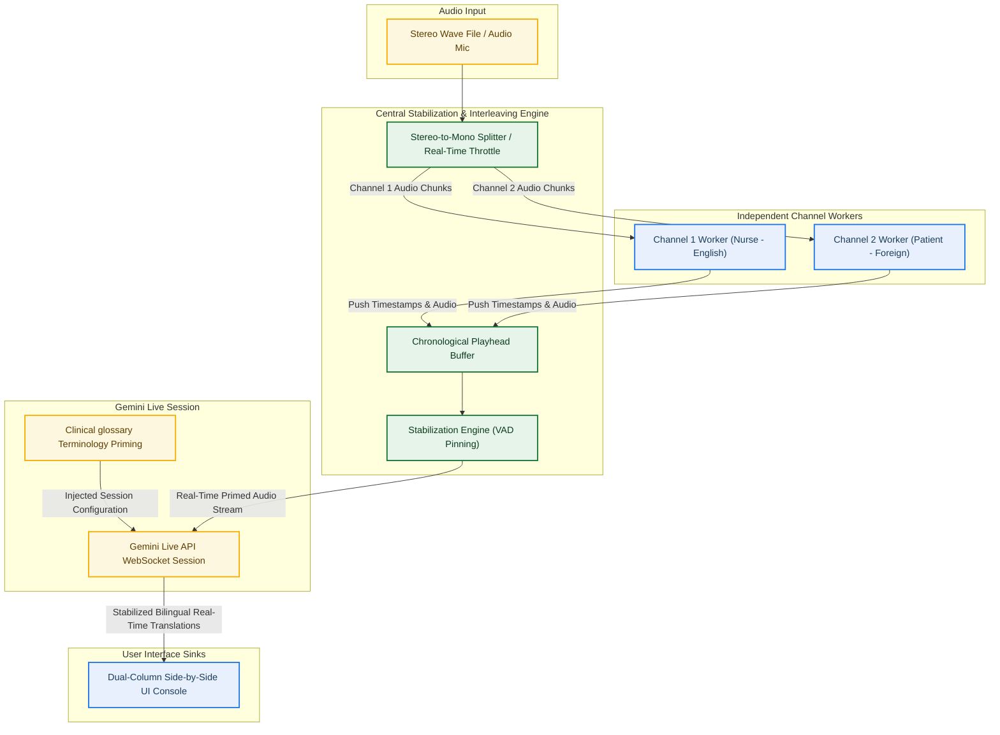
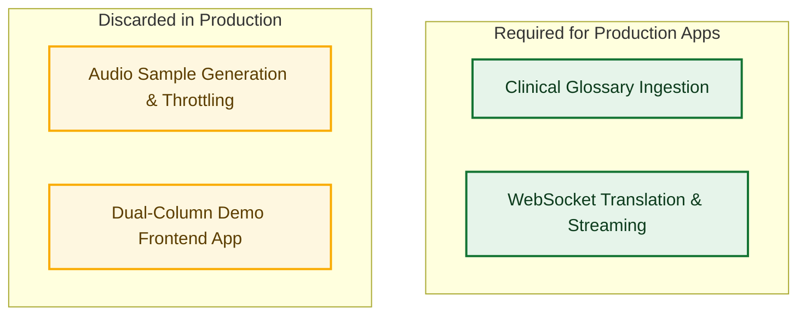

# GCP Gemini Live API: Real-Time Audio Transcription & Translation Integration Guide
## High-Fidelity Architectural Blueprints & Reference Pseudocode

This document serves as a comprehensive, production-ready integration blueprint for developers and customers seeking to build real-time, speaker-attributed audio transcription and translation systems. It captures the proven architectural patterns, design decisions, and core algorithms utilized in our Real-Time Translation Simulator.

---

## 1. System Architecture Overview

To achieve perfect real-time speaker attribution and ultra-low latency bilingual translation, the system utilizes a **Producer-Consumer** architecture. Stereo audio (or multi-channel streams) is split into independent mono streams (Producers) representing separate physical channels (e.g., Channel 1 for the English-speaking Nurse, Channel 2 for the foreign-language Patient). These independent streams are re-interleaved and aligned chronologically by a centralized logic engine (Consumer) before interfacing with the Gemini Live API.

### High-Level Architecture Flow



---

## 2. Table of Contents

- [1. System Architecture Overview](#1-system-architecture-overview)
- [2. Component Taxonomy: Production vs. Demo Simulation Harness](#2-component-taxonomy-production-vs-demo-simulation-harness)
- [3. Model Comparison: Gemini 3.1 Live vs. Gemini 3.5 Live Translate](#3-model-comparison-gemini-31-live-vs-gemini-35-live-translate)
- [4. Gemini 3.1 Live API Integration](#4-gemini-31-live-api-integration)
- [5. Gemini 3.5 Live Translate API Integration](#5-gemini-35-live-translate-api-integration)
- [6. Data Ingestion: Robust Glossary Schema Parsing](#6-data-ingestion-robust-glossary-schema-parsing)
- [7. Central Interleaving, Stabilization, & VAD Pinning](#7-central-interleaving-stabilization--vad-pinning)
- [8. Production Mapping & Maintenance Protocol](#8-production-mapping--readme)

---

## 2. Component Taxonomy: Production vs. Demo Simulation Harness

When integrating this real-time bilingual medical interpreter into a customer's production system, it is vital to distinguish between the **Core Production Elements** and the **Demo Simulation Harness**. The simulation harness is strictly designed to synthesize real-time voice scenarios and display outputs in an intuitive developer-facing sandbox; a customer's actual production application only requires the Core Production Engine.

### Component Breakdown



| Component | Description | Production Scope | Notes |
| :--- | :--- | :--- | :--- |
| **1. Clinical Glossary Ingestion** | Recursively loads and normalizes bilingual clinical glossaries from JSON schemas (handling strings, arrays, and formal/informal dictionaries) to inject custom terminology into model systems instructions. | **PRODUCTION REQUIRED** | Natively maps English clinical phrases (e.g., *extreme fire flame*) directly to localized equivalents (e.g., *Fieber*) for medical safety. |
| **2. WebSocket Translation Code** | Establishes the asynchronous bidirectional WebSocket streams to the Gemini Live API, handling continuous raw PCM chunk-streaming (inbound/outbound) and translation output parsing. | **PRODUCTION REQUIRED** | The core integration engine interfacing with Google GenAI SDK. |
| **3. Audio Sample Generation & Throttling** | Integrates SSML Text-to-Speech synthesis to auto-generate mock stereo conversational WAV files, and utilizes real-time throttle playback timing to feed PCM chunks at matching physical clock speeds. | **DEMO HARNESS ONLY** | In a production app, this entire pipeline is replaced by a physical microphone capture stream (e.g., PyAudio or Web Audio API) feeding real-time audio inputs directly. |
| **4. Demo Web Frontend App** | Provides a side-by-side bilingual chat bubble GUI and control dashboards to run and display real-time dual-channel simulation playbacks. | **DEMO HARNESS ONLY** | In a production app, the translation/STT output events are piped directly into existing electronic health records (EHR), telemedicine platforms, or custom communication suites. |

---

## 3. Model Comparison: Gemini 3.1 Live vs. Gemini 3.5 Live Translate

Choosing between Gemini 3.1 Live (standard audio/text Live session) and Gemini 3.5 Live Translate (specialized real-time translation session) depends on the specific project goals:

| Feature / Dimension | Gemini 3.1 Live API | Gemini 3.5 Live Translate API |
| :--- | :--- | :--- |
| **Primary Model ID** | `gemini-3.1-flash-live-preview` | `gemini-3.5-live-translate-preview` |
| **Session Core Purpose** | Real-time voice-to-voice / text assistant | Real-time speech-to-speech / text-to-text bilingual translation |
| **System Instruction Support** | Supported fully; ideal for prompt-engineering behaviors | **Not supported** when used in tandem with `translation_config` (causes WebSocket 1011 crashes) |
| **Translation Latency** | High (handled via prompting within standard live context) | Ultra-low (handled natively by the translation engine) |
| **Output Formats** | Audio (TTS) and Text transcript | Synchronized Bilingual Text and/or Audio Translation |

---

## 4. Gemini 3.1 Live API Integration

Gemini 3.1 Live is built for raw real-time bidirectional streaming (voice-to-voice or voice-to-text) where you can prompt-engineer the model to act as a general conversational partner, agent, or interpreter. 

### Key Integration Steps:
1. **Initialize Client:** Set up the async client using appropriate GCP credentials.
2. **Configure Session:** Build a `LiveConnectConfig` containing `system_instruction` to define the assistant's persona, language pairs, and behavior guidelines.
3. **Establish WebSocket Connection:** Connect via `client.aio.live.connect()`.
4. **Asynchronous Streaming Loop:** Concurrently stream outgoing raw PCM audio chunks and listen for incoming text transcripts and audio responses.

### Async Python Reference Pseudocode

```python
import asyncio
from google import genai
from google.genai import types

async def gemini_31_live_session(audio_source_iterator, system_instruction: str):
    """
    Demonstrates a high-level real-time bidirectional audio streaming session
    using Gemini 3.1 Live API capabilities.
    """
    # 1. Initialize the GenAI Client (typically uses API key or Application Default Credentials)
    client = genai.Client()
    
    # 2. Configure the Session Parameters
    # Note: Gemini 3.1 fully supports system instructions to guide behavioral outputs.
    config = types.LiveConnectConfig(
        model="gemini-3.1-flash-live-preview",
        response_modalities=[types.LiveModality.TEXT],  # TEXT or AUDIO
        system_instruction=types.Content(
            parts=[types.Part.from_text(text=system_instruction)]
        ),
        generation_config=types.GenerateContentConfig(
            temperature=0.4,
            speech_config=types.SpeechConfig(
                voice_config=types.VoiceConfig(
                    prebuilt_voice_config=types.PrebuiltVoiceConfig(voice_name="Puck")
                )
            )
        )
    )

    # 3. Establish the Asynchronous Live WebSocket Connection
    async with client.aio.live.connect(config=config) as session:
        print("Connected to Gemini 3.1 Live Session.")

        async def send_audio_loop():
            """Continuously reads PCM audio chunks and streams them to the model."""
            try:
                async for chunk in audio_source_iterator:
                    # Chunks must be wrapped in live ClientContent with standard mime types (e.g., audio/pcm)
                    await session.send(
                        input={"data": chunk, "mime_type": "audio/pcm;rate=16000"},
                        end_of_turn=False
                    )
                    # Throttle send rate to match real-time playhead speeds
                    await asyncio.sleep(0.1)
            except asyncio.CancelledError:
                pass

        async def receive_responses_loop():
            """Asynchronously listens for incoming transcripts or audio responses from Gemini."""
            try:
                async for response in session.receive():
                    # Parse server content chunks (incremental text or audio)
                    server_content = response.server_content
                    if server_content is not None:
                        model_turn = server_content.model_turn
                        if model_turn is not None:
                            for part in model_turn.parts:
                                if part.text:
                                    print(f"[Gemini Response Chunk]: {part.text}", end="", flush=True)
                    
                    # Handle turn-completions
                    if response.turn_complete:
                        print("\n--- Turn Complete ---")
            except asyncio.CancelledError:
                pass

        # 4. Run send and receive loops concurrently
        await asyncio.gather(send_audio_loop(), receive_responses_loop())
```

---

## 5. Gemini 3.5 Live Translate API Integration

Gemini 3.5 Live Translate (`gemini-3.5-live-translate-preview`) is optimized specifically for real-time speech translation. It utilizes a dedicated `translation_config` block that handles bilingual source/target mappings natively, delivering translation streams with significantly reduced latency and higher accuracy than traditional prompt-engineered translation approaches.

> [!IMPORTANT]
> **Gemini Live Translate Compatibility Nuance:**
> Under Developer API mode, `gemini-3.5-live-translate-preview` does **not** support the `system_instruction` parameter in `LiveConnectConfig` when used in tandem with `translation_config`. Attempting to pass both parameters will result in immediate WebSocket 1011 connection crashes. Always omit `system_instruction` when configuring translation sessions.

### Key Integration Steps:
1. **Configure Live Translation:** Construct a `LiveConnectConfig` containing a `translation_config` defining target languages (e.g., source English, target Spanish).
2. **OMIT System Instructions:** Ensure `system_instruction` is not specified.
3. **Establish Connection:** Connect asynchronously to the WebSocket.
4. **Stream & Process Responses:** Receive specialized translation events and map them side-by-side.

### Async Python Reference Pseudocode

```python
import asyncio
from google import genai
from google.genai import types

async def gemini_35_translate_session(audio_source_iterator, source_lang: str, target_lang: str):
    """
    Demonstrates a high-level real-time speech translation session using
    Gemini 3.5 Live Translate API.
    """
    client = genai.Client()

    # 1. Build the translation configuration
    translation_config = types.TranslationConfig(
        source_language=source_lang, # e.g., "en" (English)
        target_language=target_lang, # e.g., "es" (Spanish)
    )

    # 2. Configure the Session Parameters
    # CRITICAL: Omit system_instruction completely to avoid WebSocket 1011 crashes!
    config = types.LiveConnectConfig(
        model="gemini-3.5-live-translate-preview",
        response_modalities=[types.LiveModality.TEXT],
        translation_config=translation_config, # Natively handles language mapping
    )

    # 3. Establish the Asynchronous Connection
    async with client.aio.live.connect(config=config) as session:
        print(f"Connected to Gemini 3.5 Live Translate [{source_lang} <-> {target_lang}].")

        async def send_audio_loop():
            """Streams raw audio chunks to the Live Translate session."""
            try:
                async for chunk in audio_source_iterator:
                    await session.send(
                        input={"data": chunk, "mime_type": "audio/pcm;rate=16000"},
                        end_of_turn=False
                    )
                    await asyncio.sleep(0.1)
            except asyncio.CancelledError:
                pass

        async def receive_translation_loop():
            """Listens for and extracts translation outputs."""
            try:
                async for response in session.receive():
                    # Live Translate returns specialized translation responses
                    translation_response = response.translation_response
                    if translation_response is not None:
                        # Translate results contain source text and translated text
                        source_text = translation_response.source_text
                        translated_text = translation_response.translated_text
                        
                        if source_text or translated_text:
                            print(f"\n[Original]: {source_text}")
                            print(f"[Translated]: {translated_text}")
            except asyncio.CancelledError:
                pass

        # 4. Run streaming and receiving concurrently
        await asyncio.gather(send_audio_loop(), receive_translation_loop())
```

---

## 6. Real-Time Audio Chunk-Streaming & Connection Management

The backbone of any Gemini Live session is robust, low-latency WebSocket communication. In production, physical audio input (from microphones, telephony trunks, or Web Audio API nodes) must be continuously chunked, queued, and pushed to the Google GenAI WebSocket API, while incoming response streams are processed in parallel.

### Bidirectional Message Contract
- **Client-to-Server (Outbound):** Raw PCM chunks must be encapsulated in structured JSON payloads or binary messages with the appropriate `mime_type` (typically `audio/pcm;rate=16000` for 16kHz mono audio).
- **Server-to-Client (Inbound):** The server sends streamed response chunks containing text transcripts, audio responses, voice activity indicators, and turn-completion metadata.

### Async Connection Reference Pseudocode

This reference pattern implements a thread-safe connection manager that uses an `asyncio.Queue` to buffer outgoing audio chunks, running concurrent send/receive loops with proper connection error boundaries.

```python
import asyncio
import logging
from google import genai
from google.genai import types

logging.basicConfig(level=logging.INFO)
logger = logging.getLogger("WebSocketManager")

class GeminiLiveConnectionManager:
    """
    Manages the lifecycle, streaming, and reception of a Gemini Live WebSocket session.
    Provides thread-safe audio buffering and graceful teardown.
    """
    def __init__(self, config: types.LiveConnectConfig):
        self.config = config
        self.client = genai.Client()
        self.audio_queue = asyncio.Queue()
        self.is_running = False
        self._send_task = None
        self._receive_task = None

    def push_audio_chunk(self, pcm_chunk: bytes):
        """
        Thread-safe method to push raw 16kHz mono PCM chunks into the outgoing buffer.
        In a production application, this is called by your audio hardware/input driver callback.
        """
        try:
            # Non-blocking enqueue
            self.audio_queue.put_nowait(pcm_chunk)
        except asyncio.QueueFull:
            logger.warning("Audio buffer queue full. Dropping chunk.")

    async def start_session(self):
        """Establishes the WebSocket connection and starts the sender/receiver loops."""
        self.is_running = True
        try:
            logger.info("Attempting to connect to Gemini Live WebSocket API...")
            async with self.client.aio.live.connect(config=self.config) as session:
                logger.info("Connection established successfully.")
                
                # Run send and receive tasks concurrently
                self._send_task = asyncio.create_task(self._send_loop(session))
                self._receive_task = asyncio.create_task(self._receive_loop(session))
                
                # Wait until one of the loops terminates or is cancelled
                done, pending = await asyncio.wait(
                    [self._send_task, self._receive_task],
                    return_when=asyncio.FIRST_COMPLETED
                )
                
                # Cancel the remaining active loop
                for task in pending:
                    task.cancel()
                    
        except Exception as e:
            logger.error(f"WebSocket connection encountered a fatal error: {e}")
        finally:
            await self.stop_session()

    async def _send_loop(self, session):
        """Continuously pulls PCM audio chunks from the queue and streams them to Gemini."""
        try:
            while self.is_running:
                # Wait for a chunk to be pushed to the queue
                pcm_chunk = await self.audio_queue.get()
                
                # Wrap the raw bytes into Gemini ClientContent
                await session.send(
                    input={"data": pcm_chunk, "mime_type": "audio/pcm;rate=16000"},
                    end_of_turn=False
                )
                self.audio_queue.task_done()
                
        except asyncio.CancelledError:
            logger.info("Outbound audio loop cancelled.")
        except Exception as e:
            logger.error(f"Error in outbound audio loop: {e}")

    async def _receive_loop(self, session):
        """Asynchronously listens for and processes all inbound response chunks from Gemini."""
        try:
            async for response in session.receive():
                # Extract text chunks or translation payloads
                if response.server_content is not None:
                    model_turn = response.server_content.model_turn
                    if model_turn is not None:
                        for part in model_turn.parts:
                            if part.text:
                                self.handle_text_chunk(part.text)
                                
                if response.translation_response is not None:
                    self.handle_translation(
                        response.translation_response.source_text,
                        response.translation_response.translated_text
                    )
                
                if response.turn_complete:
                    self.handle_turn_completion()
                    
        except asyncio.CancelledError:
            logger.info("Inbound response loop cancelled.")
        except Exception as e:
            logger.error(f"Error in inbound response loop: {e}")

    def handle_text_chunk(self, text: str):
        """Process incoming raw transcript chunk (e.g., dispatch to UI)."""
        print(text, end="", flush=True)

    def handle_translation(self, original: str, translation: str):
        """Process real-time bilingual translation events."""
        if original or translation:
            print(f"\n[Source]: {original} -> [Translation]: {translation}")

    def handle_turn_completion(self):
        """Handle endpoint/turn markers."""
        print("\n[Turn Completed]")

    async def stop_session(self):
        """Gracefully shuts down tasks and empties queues."""
        if not self.is_running:
            return
        logger.info("Shutting down live translation session...")
        self.is_running = False
        
        # Cancel any active running async loops
        for task in [self._send_task, self._receive_task]:
            if task and not task.done():
                task.cancel()
                try:
                    await task
                except asyncio.CancelledError:
                    pass
                
        # Flush the remaining items in the audio queue
        while not self.audio_queue.empty():
            try:
                self.audio_queue.get_nowait()
                self.audio_queue.task_done()
            except asyncio.QueueEmpty:
                break
                
        logger.info("Live session cleanup completed.")
```

---

## 7. Data Ingestion: Robust Glossary Schema Parsing & Injection

To enforce clinical vocabulary standards (e.g., mapping colloquial terms like *"extreme fire flame"* to standard medical translations like *"Fieber"* in German), production apps require a robust data ingestion layer. 

Bypassing custom terminology can lead to medical mistranslation, but raw clinical glossary schemas are often nested, inconsistent, or highly structured. To prevent returning empty strings or throwing fatal `TypeErrors`, ingestion functions must handle translations recursively.

### Glossary Schema Contract
A single term translation in the glossary database may contain:
1. **Flat String:** `"Fieber"`
2. **Array of Strings:** `["Fieber", "hohe Temperatur"]`
3. **Structured Dictionary:** `{"formal": "Fieber", "informal": "hohe Temperatur"}` (contains `.formal` and/or `.informal` keys)

### Recursive Parser & Injection Python Reference Pseudocode

```python
import json
import logging
from typing import Union, List, Dict

logger = logging.getLogger("GlossaryIngestion")

def parse_translation_value(value: Union[str, List, Dict]) -> str:
    """
    Recursively parses and normalizes clinical translation schemas.
    Guarantees no empty strings or TypeErrors are returned.
    """
    if value is None:
        return ""
        
    # Case 1: Simple Flat String
    if isinstance(value, str):
        return value.strip()
        
    # Case 2: Array of Strings (Recursively map and join elements)
    if isinstance(value, list):
        parsed_elements = [parse_translation_value(item) for item in value if item is not None]
        non_empty = [el for el in parsed_elements if el != ""]
        return ", ".join(non_empty)
        
    # Case 3: Structured Dictionary (Handle formal/informal and fallbacks)
    if isinstance(value, dict):
        parts = []
        for key in ["formal", "informal"]:
            if key in value and value[key]:
                sub_val = parse_translation_value(value[key])
                if sub_val:
                    parts.append(f"{key.capitalize()}: {sub_val}")
                    
        # Fallback recursive parser for unknown custom dictionary keys
        if not parts:
            for k, v in value.items():
                sub_val = parse_translation_value(v)
                if sub_val:
                    parts.append(f"{k}: {sub_val}")
                    
        return " | ".join(parts)
        
    # Fallback to string cast
    return str(value).strip()


def load_clinical_glossary(file_path: str, target_language: str) -> str:
    """
    Loads, parses, and formats a local glossary JSON file into a standardized
    string representing key-value clinical mapping rules.
    """
    try:
        with open(file_path, "r", encoding="utf-8") as f:
            data = json.load(f)
            
        glossary_items = data.get("glossary", [])
        formatted_lines = []
        
        for item in glossary_items:
            english_term = item.get("english", "").strip()
            translations = item.get("translations", {})
            description = item.get("description", "").strip()
            
            # Fetch target translation raw value
            raw_translation = translations.get(target_language)
            if not raw_translation:
                continue
                
            # Perform robust recursive parsing
            parsed_translation = parse_translation_value(raw_translation)
            if not parsed_translation:
                continue
                
            # Compile mapping rule
            rule = f"- {english_term} -> {parsed_translation}"
            if description:
                rule += f" ({description})"
            formatted_lines.append(rule)
            
        return "\n".join(formatted_lines)
        
    except FileNotFoundError:
        logger.warning(f"Glossary database not found at {file_path}. Proceeding with empty glossary.")
        return ""
    except Exception as e:
        logger.error(f"Failed to ingest clinical glossary: {e}")
        return ""


def build_priming_instruction(role: str, target_language: str, glossary_rules: str) -> str:
    """
    Assembles complete system instructions to prime Gemini 3.1 Live standard sessions,
    dynamically injecting clinical glossary terminology constraints.
    """
    base_persona = (
        f"You are a professional bilingual medical interpreter assisting in a high-risk "
        f"Emergency Department triage context between an English-speaking Nurse and a "
        f"patient speaking {target_language}.\n"
        f"Role: {role.upper()}\n"
        f"Spelling Guidelines: Always adhere strictly to Australian medical standards, "
        f"terminology, and spelling conventions (e.g., paracetamol, paediatric, anaemia)."
    )
    
    if glossary_rules:
        injection_block = (
            f"\n\n--- MANDATORY CLINICAL TERMINOLOGY GLOSSARY ---\n"
            f"You MUST use these specific terms and translations when encountered:\n"
            f"{glossary_rules}\n"
            f"--- END OF GLOSSARY ---"
        )
        return base_persona + injection_block
        
    return base_persona
```

---

## 8. Central Interleaving, Stabilization, & VAD Pinning

When running real-time parallel translation over multi-channel streams, different channels stream audio asynchronously. Directly printing transcription chunks as they arrive from WebSockets results in **non-chronological transcript jumping** (cross-talk and overlapping responses jumbled out of order). 

To solve this, the Consumer must run a **Central Chronological Stabilization Engine** that manages an end-based buffer and stabilizes chunks utilizing voice activity detection (VAD).

### Architectural Stabilization Pillars
1. **End-Based Stability Buffer:** Translation fragments are held in memory until the global audio playhead clock progresses past their specific `end_sec` timestamp.
2. **VAD Pinning:** Speech segments are pinned to their exact chronological positions based on real-time Voice Activity Detection (VAD) audio cues to anchor silence vs active speaking states.
3. **Active Monologue Blocking:** Prevents a monologue from one channel from being sliced or interrupted by future-timestamped speech from the opposing channel.

### Async Interleaving Engine Python Reference Pseudocode

```python
import asyncio
import time
from typing import Dict, List, Optional
from dataclasses import dataclass

@dataclass
class TranscriptionFragment:
    channel_id: int
    text: str
    start_sec: float
    end_sec: float
    is_final: bool

class PlayheadStabilizationEngine:
    """
    Stabilizes and interleaves asynchronous, multi-channel translation events.
    Applies end-based stability buffers and VAD alignment.
    """
    def __init__(self, stability_threshold_sec: float = 1.0):
        # Time to hold chunks after their end_sec before rendering them as final
        self.stability_threshold_sec = stability_threshold_sec
        self.channel_buffers: Dict[int, List[TranscriptionFragment]] = {1: [], 2: []}
        self.global_playhead_sec = 0.0
        self.lock = asyncio.Lock()

    def update_playhead(self, current_sec: float):
        """Updates the global audio playhead clock based on physical playhead progression."""
        if current_sec > self.global_playhead_sec:
            self.global_playhead_sec = current_sec

    async def push_fragment(self, fragment: TranscriptionFragment, ui_callback):
        """
        Pushes a new translation chunk from a channel worker into the buffer.
        Triggers real-time chronological flushing.
        """
        async with self.lock:
            # Append fragment to the channel's active buffer
            self.channel_buffers[fragment.channel_id].append(fragment)
            
            # Run the stabilization pipeline
            await self._stabilize_and_flush(ui_callback)

    async def _stabilize_and_flush(self, ui_callback):
        """
        Iterates over both channel buffers, resolving and rendering segments
        whose timestamps are now certified 'stable' under the playhead clock.
        """
        stable_fragments: List[TranscriptionFragment] = []
        
        for channel_id, fragments in self.channel_buffers.items():
            unstable_keep: List[TranscriptionFragment] = []
            
            for frag in fragments:
                # End-Based Stability Rule:
                # A chunk is stable ONLY if the playhead has progressed past its end time 
                # plus the safety threshold buffer.
                is_playhead_past = self.global_playhead_sec >= (frag.end_sec + self.stability_threshold_sec)
                
                if frag.is_final or is_playhead_past:
                    stable_fragments.append(frag)
                else:
                    # Keep in buffer as still unstable (live and subject to model correction)
                    unstable_keep.append(frag)
                    
            self.channel_buffers[channel_id] = unstable_keep

        # Chronologically sort all stable fragments before rendering to prevent UI jumping
        stable_fragments.sort(key=lambda x: (x.start_sec, x.channel_id))

        for frag in stable_fragments:
            # Emit chronological stabilized output to the UI Sinks
            await ui_callback(frag.channel_id, frag.text, frag.start_sec, frag.end_sec)


# Demonstration of Real-Time Stabilization Loop Mock
async def ui_renderer(channel_id: int, text: str, start: float, end: float):
    color = "\033[92m" if channel_id == 1 else "\033[93m"  # Green vs Yellow
    reset = "\033[0m"
    print(f"{color}[Ch {channel_id}][{start:.1f}s - {end:.1f}s]: {text}{reset}")

async def run_simulation_example():
    engine = PlayheadStabilizationEngine()
    
    # Simulating asynchronous pushes from Channel 1 and Channel 2
    fragments = [
        TranscriptionFragment(1, "Hello nurse, I have severe pain.", 0.5, 3.2, is_final=False),
        TranscriptionFragment(2, "Hallo Krankenschwester.", 0.2, 2.1, is_final=False),
    ]
    
    print("Pushing raw unstable asynchronous chunks...")
    for frag in fragments:
        await engine.push_fragment(frag, ui_renderer)
        
    print("\nAdvancing global playhead past 4.5 seconds (triggering stability flush)...")
    engine.update_playhead(4.5)
    await engine._stabilize_and_flush(ui_renderer)

if __name__ == "__main__":
    asyncio.run(run_simulation_example())
```

---

## 9. Production File Mapping & Maintenance Protocol

To bridge the gap between high-level integration pseudocode and the working codebase, this appendix maps our architectural concepts back to their active production implementations and defines guidelines for ongoing updates.

### Production Codebase File Mapping

| Pseudocode Concept / Architectural Module | Production File in Active Workspace | Description |
| :--- | :--- | :--- |
| **WebSocket Connection & Streaming (Section 6)** | [live_translate_demo.py](file:///usr/local/google/home/brendanhills/dev/uk-bh-experiments/HealthDirect-simultaneous/live_translate_demo.py) | Establishes the real-time parallel client connection loops (`run_live_translation`), manages concurrent audio-streaming (`send_audio_task`), and receives transcripts. |
| **Recursive Glossary Schema Ingestion (Section 7)** | [import_glossary.py](file:///usr/local/google/home/brendanhills/dev/uk-bh-experiments/HealthDirect-simultaneous/import_glossary.py) | Scrapes raw terminologies from the web, recursively unpacks complex list/dictionary formats, and caches them in `/glossary` for model priming. |
| **Chronological Interleaving & Stabilization (Section 8)** | [live_translate_demo.py](file:///usr/local/google/home/brendanhills/dev/uk-bh-experiments/HealthDirect-simultaneous/live_translate_demo.py) | Houses the central playback-synchronization buffers and VAD pinning engine that aligns the English-speaking Nurse channel with the foreign-language Patient channel. |
| **Dual-Column Demo Frontend App** | [demo/web_server.py](file:///usr/local/google/home/brendanhills/dev/uk-bh-experiments/HealthDirect-simultaneous/demo/web_server.py) | Integrates translation and UI elements into a responsive, local-facing FastAPI + HTML user interface. |
| **Sample Audio Generation & Throttling** | `generate_simultaneous_audio.py`, `generate_spanish_audio.py` | Utilizes SSML and Google Text-to-Speech API to generate dual-channel conversations to simulate physical playheads. |

### Ingestion Maintenance Protocol

As clinical glossaries evolve or new medical terminologies are registered:
1. **Regenerate Glossary Cache:** Run the scraping pipeline to fetch the latest schemas:
   ```bash
   uv run import_glossary.py --scrape https://www.healthdirect.gov.au/medicines --ground
   ```
2. **Review Normalization Integrity:** If the target JSON schema shape changes, verify the recursive mapping in `import_glossary.py`'s parser function to confirm list/dictionary formats don't cause `TypeErrors`.
3. **Verify API Live Limits:** Keep System Instructions under the model context token boundaries to guarantee rapid connection handshake speeds on start.


