# GCP Gemini Live API: Real-Time Audio Transcription & Translation Integration Guide
## High-Fidelity Architectural Blueprints & Reference Pseudocode

This document serves as a comprehensive, production-ready integration blueprint for developers and customers seeking to build real-time, speaker-attributed audio transcription and translation systems. It captures the proven architectural patterns, design decisions, and core algorithms utilized in our Real-Time Translation Simulator.

---

## 1. System Architecture Overview

To achieve perfect real-time speaker attribution and ultra-low latency bilingual translation, the system utilizes a **Producer-Consumer** architecture. Stereo audio (or multi-channel streams) is split into independent mono streams (Producers) representing separate physical channels (e.g., Channel 1 for the English-speaking Nurse, Channel 2 for the foreign-language Patient). These independent streams are re-interleaved and aligned chronologically by a centralized logic engine (Consumer) before interfacing with the Gemini Live API.

### High-Level Architecture Flow

```mermaid
graph TD
    classDef main fill:#e8f0fe,stroke:#1a73e8,stroke-width:2px,color:#1c3d5a;
    classDef client fill:#fef7e0,stroke:#f9ab00,stroke-width:2px,color:#5c3e00;
    classDef engine fill:#e6f4ea,stroke:#137333,stroke-width:2px,color:#0d3c1d;
    
    subgraph Audio Input
        StereoWav["Stereo Wave File / Audio Mic"]:::client
    end
    
    subgraph Producers [Independent Channel Workers]
        Ch1["Channel 1 Worker (Nurse - English)"]:::main
        Ch2["Channel 2 Worker (Patient - Foreign)"]:::main
    end
    
    subgraph Central Brain [Central Stabilization & Interleaving Engine]
        Splitter["Stereo-to-Mono Splitter / Real-Time Throttle"]:::engine
        Buffer["Chronological Playhead Buffer"]:::engine
        Stabilizer["Stabilization Engine (VAD Pinning)"]:::engine
    end
    
    subgraph Gemini Live Session
        LiveAPI["Gemini Live API WebSocket Session"]:::client
        Glossary["Clinical glossary Terminology Priming"]:::client
    end
    
    subgraph Sinks [User Interface Sinks]
        TerminalUI["Dual-Column Side-by-Side UI Console"]:::main
    end

    StereoWav --> Splitter
    Splitter -->|Channel 1 Audio Chunks| Ch1
    Splitter -->|Channel 2 Audio Chunks| Ch2
    
    Ch1 -->|Push Timestamps & Audio| Buffer
    Ch2 -->|Push Timestamps & Audio| Buffer
    
    Buffer --> Stabilizer
    Glossary -->|Injected Session Configuration| LiveAPI
    Stabilizer -->|Real-Time Primed Audio Stream| LiveAPI
    LiveAPI -->|Stabilized Bilingual Real-Time Translations| TerminalUI
```

---

## 2. Table of Contents

- [1. System Architecture Overview](#1-system-architecture-overview)
- [3. Model Comparison: Gemini 3.1 Live vs. Gemini 3.5 Live Translate](#3-model-comparison-gemini-31-live-vs-gemini-35-live-translate)
- [4. Gemini 3.1 Live API Integration](#4-gemini-31-live-api-integration)
- [5. Gemini 3.5 Live Translate API Integration](#5-gemini-35-live-translate-api-integration)
- [6. Data Ingestion: Robust Glossary Schema Parsing](#6-data-ingestion-robust-glossary-schema-parsing)
- [7. Central Interleaving, Stabilization, & VAD Pinning](#7-central-interleaving-stabilization--vad-pinning)
- [8. Production Mapping & Maintenance Protocol](#8-production-mapping--readme)
