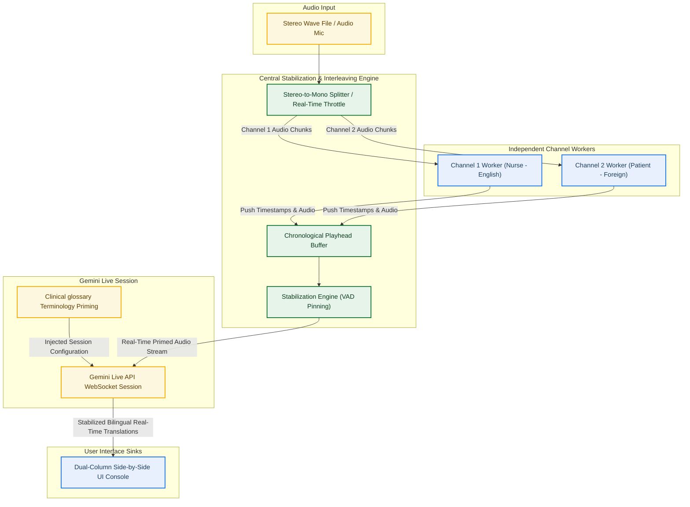

# GCP Gemini Live API: Real-Time Audio Transcription & Translation Integration Guide
## High-Fidelity Architectural Blueprints & Reference Pseudocode

This document serves as a comprehensive, production-ready integration blueprint for developers and customers seeking to build real-time, speaker-attributed audio transcription and translation systems. It captures the proven architectural patterns, design decisions, and core algorithms utilized in our Real-Time Translation Simulator.

---

## 1. System Architecture Overview

To achieve perfect real-time speaker attribution and ultra-low latency bilingual translation, the system utilizes a **Producer-Consumer** architecture. Stereo audio (or multi-channel streams) is split into independent mono streams (Producers) representing separate physical channels (e.g., Channel 1 for the English-speaking Nurse, Channel 2 for the foreign-language Patient). These independent streams are re-interleaved and aligned chronologically by a centralized logic engine (Consumer) before interfacing with the Gemini Live API.

### High-Level Architecture Flow



---

## 2. Table of Contents

- [1. System Architecture Overview](#1-system-architecture-overview)
- [3. Model Comparison: Gemini 3.1 Live vs. Gemini 3.5 Live Translate](#3-model-comparison-gemini-31-live-vs-gemini-35-live-translate)
- [4. Gemini 3.1 Live API Integration](#4-gemini-31-live-api-integration)
- [5. Gemini 3.5 Live Translate API Integration](#5-gemini-35-live-translate-api-integration)
- [6. Data Ingestion: Robust Glossary Schema Parsing](#6-data-ingestion-robust-glossary-schema-parsing)
- [7. Central Interleaving, Stabilization, & VAD Pinning](#7-central-interleaving-stabilization--vad-pinning)
- [8. Production Mapping & Maintenance Protocol](#8-production-mapping--readme)

---

## 3. Model Comparison: Gemini 3.1 Live vs. Gemini 3.5 Live Translate

Choosing between Gemini 3.1 Live (standard audio/text Live session) and Gemini 3.5 Live Translate (specialized real-time translation session) depends on the specific project goals:

| Feature / Dimension | Gemini 3.1 Live API | Gemini 3.5 Live Translate API |
| :--- | :--- | :--- |
| **Primary Model ID** | `gemini-2.0-flash-exp` / `gemini-1.5-flash` | `gemini-3.5-live-translate-preview` |
| **Session Core Purpose** | Real-time voice-to-voice / text assistant | Real-time speech-to-speech / text-to-text bilingual translation |
| **System Instruction Support** | Supported fully; ideal for prompt-engineering behaviors | **Not supported** when used in tandem with `translation_config` (causes WebSocket 1011 crashes) |
| **Translation Latency** | High (handled via prompting within standard live context) | Ultra-low (handled natively by the translation engine) |
| **Output Formats** | Audio (TTS) and Text transcript | Synchronized Bilingual Text and/or Audio Translation |

---

## 4. Gemini 3.1 Live API Integration

Gemini 3.1 Live is built for raw real-time bidirectional streaming (voice-to-voice or voice-to-text) where you can prompt-engineer the model to act as a general conversational partner, agent, or interpreter. 

### Key Integration Steps:
1. **Initialize Client:** Set up the async client using appropriate GCP credentials.
2. **Configure Session:** Build a `LiveConnectConfig` containing `system_instruction` to define the assistant's persona, language pairs, and behavior guidelines.
3. **Establish WebSocket Connection:** Connect via `client.aio.live.connect()`.
4. **Asynchronous Streaming Loop:** Concurrently stream outgoing raw PCM audio chunks and listen for incoming text transcripts and audio responses.

### Async Python Reference Pseudocode

```python
import asyncio
from google import genai
from google.genai import types

async def gemini_31_live_session(audio_source_iterator, system_instruction: str):
    """
    Demonstrates a high-level real-time bidirectional audio streaming session
    using Gemini 3.1 Live API capabilities.
    """
    # 1. Initialize the GenAI Client (typically uses API key or Application Default Credentials)
    client = genai.Client()
    
    # 2. Configure the Session Parameters
    # Note: Gemini 3.1 fully supports system instructions to guide behavioral outputs.
    config = types.LiveConnectConfig(
        model="gemini-2.0-flash-exp",
        response_modalities=[types.LiveModality.TEXT],  # TEXT or AUDIO
        system_instruction=types.Content(
            parts=[types.Part.from_text(text=system_instruction)]
        ),
        generation_config=types.GenerateContentConfig(
            temperature=0.4,
            speech_config=types.SpeechConfig(
                voice_config=types.VoiceConfig(
                    prebuilt_voice_config=types.PrebuiltVoiceConfig(voice_name="Puck")
                )
            )
        )
    )

    # 3. Establish the Asynchronous Live WebSocket Connection
    async with client.aio.live.connect(config=config) as session:
        print("Connected to Gemini 3.1 Live Session.")

        async def send_audio_loop():
            """Continuously reads PCM audio chunks and streams them to the model."""
            try:
                async for chunk in audio_source_iterator:
                    # Chunks must be wrapped in live ClientContent with standard mime types (e.g., audio/pcm)
                    await session.send(
                        input={"data": chunk, "mime_type": "audio/pcm;rate=16000"},
                        end_of_turn=False
                    )
                    # Throttle send rate to match real-time playhead speeds
                    await asyncio.sleep(0.1)
            except asyncio.CancelledError:
                pass

        async def receive_responses_loop():
            """Asynchronously listens for incoming transcripts or audio responses from Gemini."""
            try:
                async for response in session.receive():
                    # Parse server content chunks (incremental text or audio)
                    server_content = response.server_content
                    if server_content is not None:
                        model_turn = server_content.model_turn
                        if model_turn is not None:
                            for part in model_turn.parts:
                                if part.text:
                                    print(f"[Gemini Response Chunk]: {part.text}", end="", flush=True)
                    
                    # Handle turn-completions
                    if response.turn_complete:
                        print("\n--- Turn Complete ---")
            except asyncio.CancelledError:
                pass

        # 4. Run send and receive loops concurrently
        await asyncio.gather(send_audio_loop(), receive_responses_loop())
```

---

## 5. Gemini 3.5 Live Translate API Integration

Gemini 3.5 Live Translate (`gemini-3.5-live-translate-preview`) is optimized specifically for real-time speech translation. It utilizes a dedicated `translation_config` block that handles bilingual source/target mappings natively, delivering translation streams with significantly reduced latency and higher accuracy than traditional prompt-engineered translation approaches.

> [!IMPORTANT]
> **Gemini Live Translate Compatibility Nuance:**
> Under Developer API mode, `gemini-3.5-live-translate-preview` does **not** support the `system_instruction` parameter in `LiveConnectConfig` when used in tandem with `translation_config`. Attempting to pass both parameters will result in immediate WebSocket 1011 connection crashes. Always omit `system_instruction` when configuring translation sessions.

### Key Integration Steps:
1. **Configure Live Translation:** Construct a `LiveConnectConfig` containing a `translation_config` defining target languages (e.g., source English, target Spanish).
2. **OMIT System Instructions:** Ensure `system_instruction` is not specified.
3. **Establish Connection:** Connect asynchronously to the WebSocket.
4. **Stream & Process Responses:** Receive specialized translation events and map them side-by-side.

### Async Python Reference Pseudocode

```python
import asyncio
from google import genai
from google.genai import types

async def gemini_35_translate_session(audio_source_iterator, source_lang: str, target_lang: str):
    """
    Demonstrates a high-level real-time speech translation session using
    Gemini 3.5 Live Translate API.
    """
    client = genai.Client()

    # 1. Build the translation configuration
    translation_config = types.TranslationConfig(
        source_language=source_lang, # e.g., "en" (English)
        target_language=target_lang, # e.g., "es" (Spanish)
    )

    # 2. Configure the Session Parameters
    # CRITICAL: Omit system_instruction completely to avoid WebSocket 1011 crashes!
    config = types.LiveConnectConfig(
        model="gemini-3.5-live-translate-preview",
        response_modalities=[types.LiveModality.TEXT],
        translation_config=translation_config, # Natively handles language mapping
    )

    # 3. Establish the Asynchronous Connection
    async with client.aio.live.connect(config=config) as session:
        print(f"Connected to Gemini 3.5 Live Translate [{source_lang} <-> {target_lang}].")

        async def send_audio_loop():
            """Streams raw audio chunks to the Live Translate session."""
            try:
                async for chunk in audio_source_iterator:
                    await session.send(
                        input={"data": chunk, "mime_type": "audio/pcm;rate=16000"},
                        end_of_turn=False
                    )
                    await asyncio.sleep(0.1)
            except asyncio.CancelledError:
                pass

        async def receive_translation_loop():
            """Listens for and extracts translation outputs."""
            try:
                async for response in session.receive():
                    # Live Translate returns specialized translation responses
                    translation_response = response.translation_response
                    if translation_response is not None:
                        # Translate results contain source text and translated text
                        source_text = translation_response.source_text
                        translated_text = translation_response.translated_text
                        
                        if source_text or translated_text:
                            print(f"\n[Original]: {source_text}")
                            print(f"[Translated]: {translated_text}")
            except asyncio.CancelledError:
                pass

        # 4. Run streaming and receiving concurrently
        await asyncio.gather(send_audio_loop(), receive_translation_loop())
```


