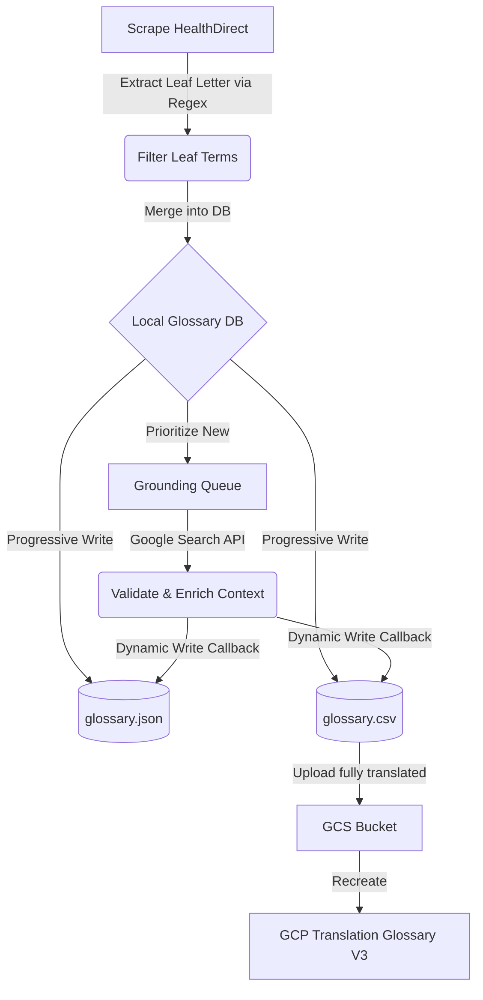

# System Handover & Progress Summary: HealthDirect Glossary Pipeline

This document outlines the progress, architectural changes, and validation status of the **HealthDirect Glossary Ingestion & Translation Pipeline** as of June 29, 2026.

## 1. Executive Summary of Improvements
We completed several high-fidelity enhancements to the `import_glossary.py` pipeline and associated test suite. The pipeline is now completely self-healing, handles partial failures gracefully without data loss, and ensures strict chronological and alphabetical filtering.

### Key Achievements:
1. **Leaf-Page Target Letter Filtering:** Fixed an issue where crawling leaf-pages (e.g., `/health-topics/H`) would ingest unrelated letter links (like "A" index links). We now extract the active leaf letter directly from URLs (such as `/health-topics/([A-Za-z])$` and `/medicines/search-results/([A-Za-z])(?:-|$)`) and enforce filtering to keep only matching terms.
2. **Progressive / Dynamic Saving:** Replaced the "save-at-the-end" architecture. The script now progressively commits newly crawled terms, translations, and search-grounding events to both `dictionary/glossary.json` and `dictionary/glossary.csv` immediately after each discrete unit of work completes. This ensures zero data loss on network dropouts, API rate-limiting (HTTP 429), or Ctrl+C.
3. **Exhaustive & Prioritized Grounding Queue:** Whenever automated search-grounding (`--ground`) is requested, the pipeline scans the entire historical database (not just newly scraped terms) to locate and queue *any* term missing Spanish or Vietnamese grounding context. 
4. **Active Prioritization:** The grounding engine processes newly scraped terms first (guaranteeing immediate feedback/ingestion updates) followed chronologically by the historical backlog.
5. **Metadata Preservation:** Fixed a bug in `pre_translate_terms` where existing grounding metadata was stripped during database merges by replacing shallow dict overrides with safe copy operations.
6. **100% Robust Test Coverage:** Cleaned up broken mock interfaces in `tests/test_import_glossary.py`. Mocked `random.sample` to prevent flakiness under `--max-letters` random selection, and added robust coverage for the leaf-filtering, exhaustive grounding queues, and progressive saving.

---

## 2. Updated Project Files

*   **[`import_glossary.py`](file:///home/brendanhills/dev/uk-bh-experiments/HealthDirect/import_glossary.py)**: Refactored with dynamic callbacks, prioritized queues, safe cloning, and leaf-page URL regex extraction.
*   **[`tests/test_import_glossary.py`](file:///home/brendanhills/dev/uk-bh-experiments/HealthDirect/tests/test_import_glossary.py)**: Strengthened with 3 new targeted test cases; all 37 tests passing cleanly.
*   **[`README.md`](file:///home/brendanhills/dev/uk-bh-experiments/HealthDirect/README.md)**: Updated with a dedicated clinical terminology pipeline guide.

---

## 3. How to Run & Verify

### Run Pipeline (Dry-run or Sample Ingestion)
To scrape 3 random letters and limit to 2 terms each, writing dynamically to local JSON/CSV:
```bash
uv run import_glossary.py --scrape "https://www.healthdirect.gov.au/medicines" --max-letters 3 --limit-terms 2
```

### Run Pipeline with Search Grounding
To query search evidence/context for newly crawled terms and any historical entries missing grounding metadata:
```bash
uv run import_glossary.py --scrape "https://www.healthdirect.gov.au/medicines" --ground
```

### Run Test Suite
To execute all unit tests and verify code correctness:
```bash
uv run pytest
```

---

## 4. Architectural State



All functions are clean, documented, and fully integrated. The workspace is stable and prepared for the next development session.
