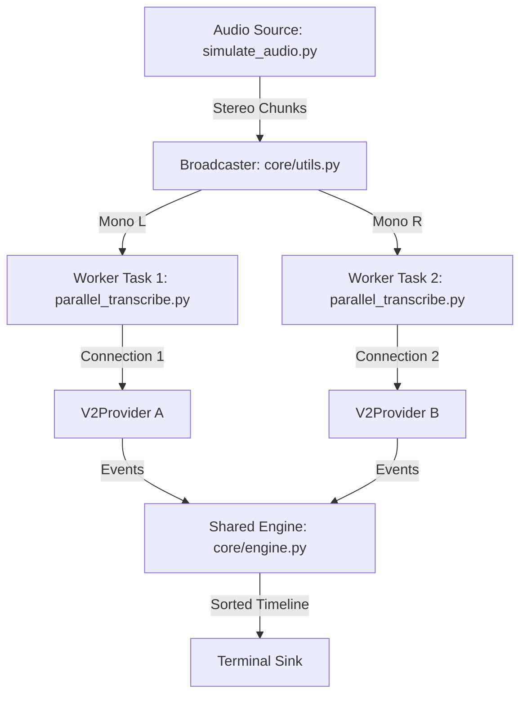

# Code Walkthrough: Parallel Multi-Worker Approach

This document explains the advanced "Parallel" architecture used for transcribing multiple audio channels using independent API connections for each channel.

## High-Level Architecture

The Parallel approach splits a single stereo source into **two separate mono streams**. Each stream is handled by its own independent background task and API connection. This provides maximum flexibility for transcribing speakers on different microphones or locations.

## Configuration & Options

The parallel approach provides maximum control over the multi-worker pipeline:

| Flag | Default | Description |
| :--- | :--- | :--- |
| `--arch` | `mode_a` | **Sync Strategy:** `mode_a` (Centralized Engine) vs `mode_b` (Distributed/Local Worker stability). |
| `--mode` | `readability` | **Presets:** `readability` (stable/interleaved) vs `low_latency` (instant/raw). |
| `--stability` | `1.0s` | **Buffer:** How long the Engine (or Worker) holds results for sorting. |
| `--gap` | `0.5s` | **Turn Splitting:** Amount of silence required between words to force a turn break. |
| `--model` | `telephony` | **STT Model:** Underlying Google model used for both connections. |

## Architecture Modes

The parallel approach supports two synchronization strategies via the `--arch` flag:

### Mode A: Centralized Interleaving (Default)
Workers are simple "raw" pipes. All incoming results from both API connections are sent to the **Shared Engine**, which handles the complex task of chronological re-assembly and natural turn-splitting. This ensures that overlaps and interjections are correctly woven together.

### Mode B: Distributed Stabilization
Each worker handles its own stabilization and gap-splitting logic locally. The **Shared Engine** receives already-finalized segments and simply passes them to the UI. This mode tests how well independent "stabilized" channels can be merged without a centralized brain.

## Step-by-Step Logic

### 1. The Stereo Broadcaster (`run_broadcaster`)
In the two-channel approach, the broadcaster just pipes bytes. In Parallel mode, the broadcaster takes on a "low-level" audio processing role:
*   It takes a stereo chunk from the simulator.
*   It uses `audioop.tomono` to split the interleaved stereo bytes into two separate mono buffers.
*   It places `Buffer L` into `Queue 1` and `Buffer R` into `Queue 2`.
*   It continues to drive the shared Engine clock.

### 2. Independent API Workers (`worker`)
Two concurrent worker tasks are spawned. Each worker:
*   Opens its own independent GRPC stream to Google Cloud.
*   Uses a unique `channel_id` (1 or 2) to tag its results.
*   Handles its own network health and re-connection logic (via the Provider).
*   Pushes raw `TranscriptionEvents` into the **Shared Engine**.

### 3. Chronological Merging (`TranscriptionEngine`)
The Engine is shared between both workers. This is the most critical part of the Parallel architecture:
*   Because the two API connections are independent, results from Speaker 1 might arrive 500ms earlier or later than results from Speaker 2 for the same moment in time.
*   The Engine's `stability_buffer` acts as a **re-assembly point**. It holds all incoming events and sorts them by their true audio timestamps before they ever reach the UI.
*   This ensures that even though the data was processed by two different "brains" (API connections), the final transcript is perfectly interleaved.

### 4. Dynamic UI (`TerminalSink`)
The UI sink doesn't care that the data came from two different workers. It simply receives a stream of sorted, finalized events and renders them in the appropriate column based on the tagged `speaker_id`.

## Comparison: Parallel vs. Two-Channel

| Feature | Parallel | Two-Channel |
| :--- | :--- | :--- |
| **Complexity** | High (2x Queues, 2x Workers) | Low (Single stream) |
| **Flexibility** | Maximum (Cross-file/Cross-mic) | Limited (Single stereo source) |
| **Cost/Quota** | 2x Connections (Higher quota hit) | 1x Connection |
| **Integrity** | High (Relies on Engine sorting) | High (Native API support) |

## Why use this approach?
*   **Scale:** If you have 10 people talking on 10 different microphones, you cannot put them all in one stereo file. You *must* use parallel workers.
*   **Isolation:** If one speaker's audio is noisy or needs different API settings (e.g., a different language or model), you can configure their worker independently without affecting the other speakers.
