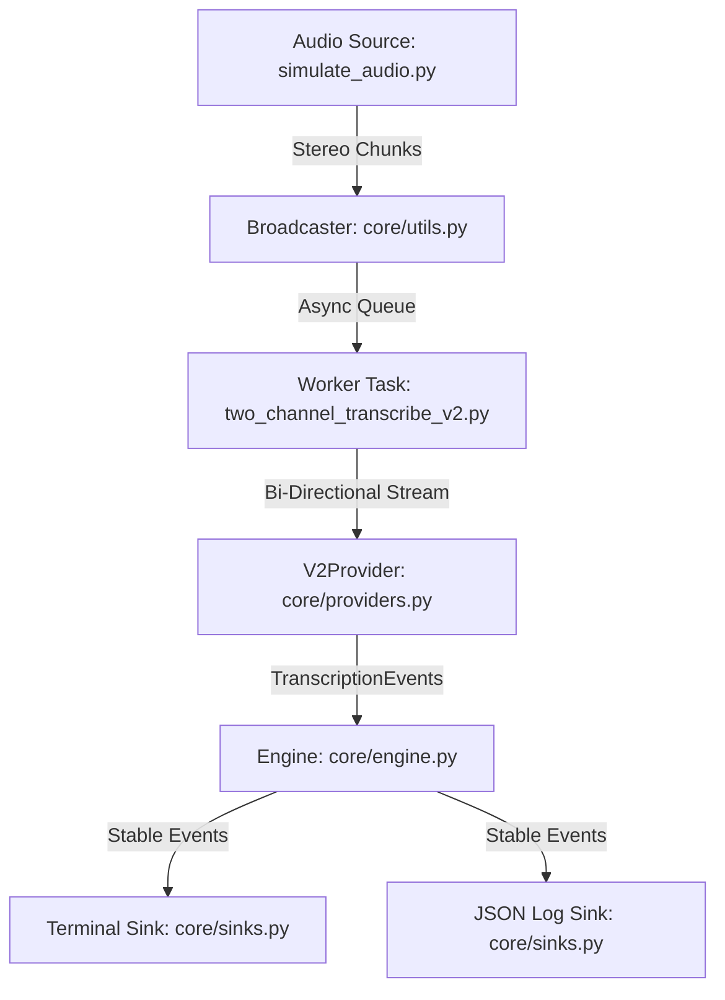

# Code Walkthrough: Two-Channel Approach

This document explains the standard, recommended approach for real-time multi-channel transcription using Google Cloud Speech-to-Text V2.

## High-Level Architecture

The Two-Channel approach uses a **single bi-directional GRPC connection** to the Google STT API. The audio file is streamed as a stereo signal, and the API handles speaker separation based on the audio channels (Channel 1 = Caller, Channel 2 = Agent).

## Configuration & Options

The simulator provides several knobs to tune the balance between speed and readability:

| Flag | Default | Description |
| :--- | :--- | :--- |
| `--mode` | `readability` | **Presets:** `readability` (stable/interleaved) vs `low_latency` (instant/raw). |
| `--stability` | `1.0s` | **Buffer:** How long the Engine holds results to allow for chronological re-ordering. Higher = more stable. |
| `--gap` | `0.5s` | **Turn Splitting:** Amount of silence between words required to split a block of text into a new speaker turn. |
| `--chunk-size` | `0.1s` | **Streaming Rate:** The duration of each audio packet sent to the API. |
| `--model` | `telephony` | **STT Model:** Selection of the underlying Google model (e.g., `telephony`, `chirp_2`). |

## Step-by-Step Logic

### 1. Ingestion (`AudioStreamSimulator`)
The simulator reads a local file or downloads from GCS. It normalizes the audio to **Linear16 PCM** and calculates the precise timing needed to stream the file at its natural playback speed.

### 2. Broadcasting (`run_broadcaster`)
This background task acts as the heartbeat of the system.
*   It yields audio chunks (e.g., 100ms or 250ms) from the simulator.
*   It puts these chunks into an `asyncio.Queue` for the API worker.
*   **Crucially**, it advances the `TranscriptionEngine`'s internal clock (`set_audio_time`) every time a chunk is sent. This allows the engine to know when it's safe to release buffered events during periods of silence.

### 3. API Streaming (`V2Provider`)
The `api_worker` consumes chunks from the queue and sends them to the `V2Provider`.
*   The provider manages the `StreamingRecognize` request stream.
*   It configures `multi_channel_mode`, telling Google to keep the two channels separate.
*   It yields `TranscriptionEvent` objects as soon as results (Interim or Final) arrive from the API.

### 4. Stabilization & Splitting (`TranscriptionEngine`)
The engine is the "Brain" that ensures the transcript remains readable and chronological.
*   **Interim Results:** Passed through immediately to the UI to provide a "live typing" effect.
*   **Final Results:** Held in a `stability_buffer` until the Broadcaster's clock has progressed past the result's `end_sec`.
*   **Gap Splitting:** If the API returns a giant 10-second block of text, the engine inspects the word-level timestamps and splits the block at any silence gap (e.g., > 0.5s) to create natural turns.
*   **Active Blocking:** If Speaker A is still talking (Interim detected), the engine will block Speaker B's finalized interjection from appearing until Speaker A is finished, ensuring the interjection isn't "buried" in the past.

### 5. Rendering (`TerminalSink`)
The sink handles the complex task of drawing two speakers in two columns.
*   **Overwriting:** It uses ANSI escape codes to move the cursor up and overwrite the previous grey "draft" text with the latest update.
*   **Dynamic Reflow:** If a result arrives late but its timestamp places it earlier in the conversation, the sink "rolls back" the terminal, inserts the new turn, and re-prints the subsequent history to maintain visual chronological integrity.

## Why use this approach?
*   **Simplicity:** Only one network connection to manage.
*   **Efficiency:** Less overhead on the client side (no manual audio splitting).
*   **Reliability:** Native Google support for channel-based speaker attribution.
