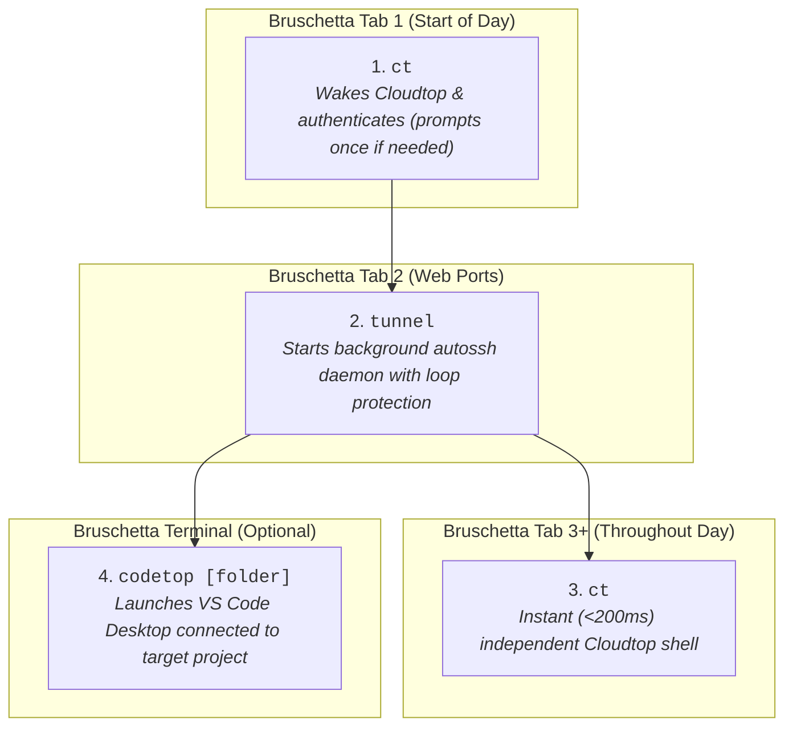

# Chromebook (Bruschetta) to Cloudtop Remote Development Setup

A battle-tested, high-reliability configuration guide and automation toolkit for Google Customer Engineers and Developers working remotely from a **Chromebook (ChromeOS / Bruschetta gLinux VM)** connected to **Google Cloudtop**.

---

## 1. Why this Setup Exists

Connecting to Cloudtop from a Chromebook over Google's WebSocket proxy (`sup-ssh-relay`) often encounters common friction points:
* **Multiplexing Deadlocks (`ControlMaster`):** Shared SSH sockets break when laptops sleep or switch networks, permanently locking forwarded ports with `Address already in use`.
* **Security Key Prompt Loops:** `autossh` backgrounding before authentication causes endless Titan Security Key popup loops (5–7+ popups).
* **Identity Probing Failures:** SSH attempts to probe every FIDO2 slot and corporate key sequentially, triggering multiple key touches per connection.
* **Overloaded File Watchers:** Opening `$HOME` over VS Code Remote-SSH recursively indexes `~/.cache`, `~/.local`, and `~/.antigravity`, causing 10,000+ Git change warnings and extension host freezes.
* **Keepalive Conflicts:** `TCPKeepAlive yes` sends raw OS TCP ACK probes that fail through WebSocket relays.

This setup resolves all of these issues with **zero socket multiplexing conflicts**, **single-touch morning authentication**, and **isolated, sub-200ms terminal sessions**.

---

## 2. Directory Structure

```text
ce_chromebox_setup/
├── README.md                          # Comprehensive guide, visual diagrams, and troubleshooting
├── install.sh                         # Interactive setup script (auto-templates config with backups)
│
├── chromebook/                        # --- Configs for Chromebook (Bruschetta VM) ---
│   ├── ssh_config.template            # ~/.ssh/config template (no multiplexing, IdentitiesOnly)
│   └── bashrc_additions.sh            # ~/.bashrc snippet (smart ct, tunnel daemon, codetop, green theme)
│
└── cloudtop/                          # --- Configs for Cloudtop Workstation ---
    ├── bashrc_additions.sh            # ~/.bashrc snippet (purple cloud theme & login banner)
    └── tunnel-shell                   # Helper script for ChromeOS native Terminal SWA
```

---

## 3. Architecture & Daily Flow



### The Step-by-Step Routine

| Step | Location | Command | Description |
| :--- | :--- | :--- | :--- |
| **1. Morning Connect & Auth** | Bruschetta Tab 1 | `ct` | Auto-detects credential state. Prompts once for password/security key if expired, wakes Cloudtop, and opens your primary shell. |
| **2. Start Web Ports** | Bruschetta Tab 2 | `tunnel` | Launches background `autossh` daemon with loop protection (`AUTOSSH_MAXSTART=1`). Connects silently with verified credentials. |
| **3. Open More Shell Tabs** | New Bruschetta Tabs | `ct` | Opens additional fresh, independent SSH tabs on Cloudtop in <200ms. |
| **4. Open VS Code** | Bruschetta Tab | `codetop [project]` | Launches VS Code connected to targeted project folder (avoids root `$HOME` file-watcher overload). |

### Tunnel Management Commands (Run in Bruschetta)

| Task | Command | Expected Output |
| :--- | :--- | :--- |
| **Start Tunnel** | `tunnel` | Authenticates via `rw`, starts daemon $\rightarrow$ `✅ Background tunnel active` |
| **Check Status** | `tunnel-status` | Displays running `autossh` PID and command line. |
| **Stop Tunnel** | `tunnel-stop` | `🛑 Tunnel stopped` |
| **Restart Tunnel** | `tunnel-restart` | Stops and restarts the background daemon. |

---

## 4. Quickstart Installation

### Option A: Interactive Wizard (Recommended)
Run the setup script inside your **Bruschetta VM**:
```bash
./install.sh
```
The script will:
1. Prompt for your LDAP and Cloudtop machine name.
2. Back up your existing `~/.ssh/config` and `~/.bashrc`.
3. Template and append the required host blocks and aliases safely.

---

### Option B: Manual Setup

#### 1. On your Chromebook (Bruschetta VM):
1. Copy the host blocks from [`chromebook/ssh_config.template`](chromebook/ssh_config.template) into `~/.ssh/config`, replacing `<CLOUDTOP_NAME>` and `<LDAP_USERNAME>` with your details.
2. Append the functions from [`chromebook/bashrc_additions.sh`](chromebook/bashrc_additions.sh) to `~/.bashrc`.
3. Reload shell: `source ~/.bashrc`.

#### 2. On your Cloudtop Workstation:
1. Append [`cloudtop/bashrc_additions.sh`](cloudtop/bashrc_additions.sh) to `~/.bashrc` on Cloudtop for visual styling and login banners.
2. (Optional) Copy [`cloudtop/tunnel-shell`](cloudtop/tunnel-shell) to `~/bin/tunnel-shell` (`chmod +x ~/bin/tunnel-shell`) if using ChromeOS native Terminal links.

---

## 5. Port Forwarding Directory

| Port | Service | Access URL | Notes |
| :--- | :--- | :--- | :--- |
| **`9000`** | Primary Web App / Dev Server | `http://localhost:9000` | Main local debugging port. |
| **`9090`** | Secondary Web App / API | `http://localhost:9090` | Secondary dev service. |
| **`9900`** | Tertiary Web App / Worker | `http://localhost:9900` | Additional staging/test service. |
| **`8888`** | Google Colab Local Runtime / Jupyter | `http://localhost:8888` | Connects browser Colab notebook to Cloudtop execution kernel. |
| **`5387`** | Jetski Hub Server | `http://jetski/?box=<CLOUDTOP_NAME>`<br>*(or `http://localhost:5387`)* | Primary access via ÜberProxy; local port forwarded as fallback. |

---

## 6. Native ChromeOS Terminal Links (No Bruschetta VM Needed)

If you need instant terminal access directly in ChromeOS without starting the Bruschetta VM:
* **Command Box:** (ChromeOS Terminal already includes `ssh `, so do not type `ssh`):
  ```text
  <USER>@<CLOUDTOP_NAME>.c.googlers.com -L 9000:localhost:9000 -L 9090:localhost:9090 -L 9900:localhost:9900 -L 8888:localhost:8888 -o ServerAliveInterval=15 -o ServerAliveCountMax=3 -t ~/bin/tunnel-shell
  ```
* **SSH relay server options:** `--config=google`

---

## 7. Troubleshooting Runbook

### Issue 1: Multiple Security Key Popups in a Row
* **Cause:** `autossh` was launched in the background before credentials were valid, or `IdentitiesOnly yes` is missing.
* **Fix:**
  ```bash
  pkill -9 -f autossh; pkill -9 -f cloudtop-tunnel
  ```
  Ensure `IdentitiesOnly yes` is present in `~/.ssh/config` and run `ct` first to authenticate in the foreground.

### Issue 2: Port Locked (`Address in use`)
* **Cause:** A previous hung SSH process is still listening on port 9000 or 8888.
* **Fix:**
  ```bash
  sudo kill -9 $(lsof -t -i :9000 -i :8888) 2>/dev/null || true
  tunnel-restart
  ```

### Issue 3: VS Code Shows ">10,000 Changes in Git" or Slow Extension Loading
* **Cause:** An accidental `.git` folder was created in root `$HOME`.
* **Fix:** Run on Cloudtop:
  ```bash
  rm -rf ~/.git
  ```

### Issue 4: `Connection closed by UNKNOWN port 65535`
* **Cause:** SSO master cookie expired.
* **Fix:** Run `ct` to trigger roadwarrior authentication.
