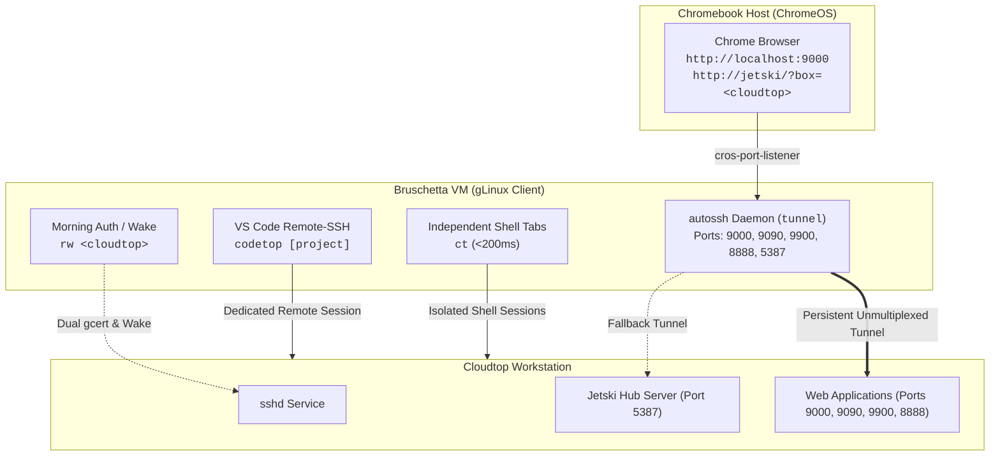

# Chromebook (Bruschetta) to Cloudtop Remote Development Setup

A battle-tested, high-reliability configuration guide and automation toolkit for Google Customer Engineers and Developers working remotely from a **Chromebook (ChromeOS / Bruschetta gLinux VM)** connected to **Google Cloudtop**.

---

## 1. Why this Setup Exists

Connecting to Cloudtop from a Chromebook over Google's WebSocket proxy (`sup-ssh-relay`) often suffers from common friction points:
* **Multiplexing Deadlocks (`ControlMaster`):** Shared SSH sockets break when laptops sleep or switch networks, permanently locking forwarded ports with `Address already in use`.
* **Security Key Prompt Loops:** `autossh` backgrounding before authentication causes endless Titan Security Key popup loops (5–7+ popups).
* **Identity Probing Failures:** SSH attempts to probe every FIDO2 slot and corporate key sequentially, triggering multiple key touches per connection.
* **Overloaded File Watchers:** Opening `$HOME` over VS Code Remote-SSH recursively indexes `~/.cache`, `~/.local`, and `~/.antigravity`, causing 10,000+ Git change warnings and extension host freezes.
* **Keepalive Conflicts:** `TCPKeepAlive yes` sends raw OS TCP ACK probes that fail through WebSocket relays.

This setup resolves all of these issues with **zero socket multiplexing conflicts**, **single-touch morning authentication**, and **isolated, sub-200ms terminal sessions**.

---

## 2. Architecture & Daily Flow



---

## 3. Daily Workflow (TL;DR)

All daily commands run in your **Bruschetta terminal**:

| Step | Command | Description |
| :--- | :--- | :--- |
| **1. Start Web Ports & Auth** | `tunnel` | Validates 8h cert freshness in foreground (prompts once if needed), wakes Cloudtop, then starts background `autossh` daemon with loop protection (`AUTOSSH_MAXSTART=1`). |
| **2. Open Cloudtop Shell** | `ct` | Auto-detects credential state. Connects instantly (<200ms) if valid, or prompts via `roadwarrior` if expired. |
| **3. Open VS Code Desktop** | `codetop [project]` | Launches VS Code Desktop on Cloudtop directly at `~/dev` (or a specific repo), avoiding home directory file-watcher overload. |
| **4. Open More Terminal Tabs** | `ct` | Every new tab is 100% independent and isolated with distinct visual prompt styling. |

---

## 4. Setup Instructions

### Step A: Configure Bruschetta OpenSSH (`~/.ssh/config`)
Copy `ssh_config.template` to `~/.ssh/config` in Bruschetta and update your username/hostname:

```sshconfig
##### Primary Cloudtop Host (Clean, Independent Shell Sessions & VS Code)
Host <YOUR_CLOUDTOP_NAME>.c.googlers.com <YOUR_CLOUDTOP_NAME> cloudtop ct
  HostName <YOUR_CLOUDTOP_NAME>.c.googlers.com
  User <YOUR_LDAP>
  AddressFamily inet
  IdentitiesOnly yes

##### Dedicated Background Tunnel Host (Web Dev & Colab Ports)
Host cloudtop-tunnel
  HostName <YOUR_CLOUDTOP_NAME>.c.googlers.com
  User <YOUR_LDAP>
  AddressFamily inet
  ExitOnForwardFailure yes
  IdentitiesOnly yes
  LocalForward 9000 127.0.0.1:9000
  LocalForward 9090 127.0.0.1:9090
  LocalForward 9900 127.0.0.1:9900
  LocalForward 8888 127.0.0.1:8888
  LocalForward 5387 127.0.0.1:5387

##### GitHub
Host github.com
  IdentitiesOnly yes
  AddKeysToAgent yes

##### Global Defaults (No Multiplexing, Optimized WebSocket KeepAlive)
Host *
  TCPKeepAlive no
  ServerAliveInterval 15
  ServerAliveCountMax 3
  ConnectTimeout 30
  ConnectionAttempts 3
  ForwardX11 no
```

---

### Step B: Add Aliases to Bruschetta (`~/.bashrc`)
Add the contents of `bruschetta_bashrc.sh` to your Bruschetta `~/.bashrc`:

```bash
# --- Visual Styling (Green Laptop Theme) ---
PS1='\[\e]0;💻 Bruschetta: \w\a\]\[\033[01;32m\]💻 bruschetta\[\033[00m\]:\[\033[01;34m\]\w\[\033[00m\]\$ '

# --- VS Code Remote on Cloudtop (Defaults to ~/dev) ---
unalias codetop 2>/dev/null || true
codetop() {
  local target="${1:-/usr/local/google/home/$USER/dev}"
  if [[ "$target" != /* ]]; then
    target="/usr/local/google/home/$USER/dev/$target"
  fi
  code --remote ssh-remote+cloudtop "$target"
}

# --- Smart Cloudtop Connect ---
unalias ct 2>/dev/null || true
ct() {
  if command -v gcertstatus >/dev/null 2>&1 && ! gcertstatus --check_ssh_certs >/dev/null 2>&1; then
    echo "🔑 Credentials expired. Authenticating via roadwarrior..."
    rw --check_remaining --check_remaining_duration=8h --remote_gcertstatus_args="--check_remaining=8h" cloudtop "$@"
  else
    ssh cloudtop "$@"
  fi
}

alias rw='rw --check_remaining --check_remaining_duration=8h --remote_gcertstatus_args="--check_remaining=8h"'

# --- Background Port Tunnel Management (With Auto-Auth & Loop Protection) ---
alias tunnel='AUTOSSH_MAXSTART=1 rw --nossh_interactively --check_remaining --check_remaining_duration=8h --remote_gcertstatus_args="--check_remaining=8h" cloudtop && AUTOSSH_MAXSTART=1 autossh -M 0 -f -N cloudtop-tunnel && echo "✅ Background tunnel active (ports 9000, 9090, 9900, 8888, 5387)"'
alias tunnel-status='pgrep -fa "autossh.*cloudtop-tunnel" || echo "❌ Tunnel is not running"'
alias tunnel-stop='pkill -f "autossh.*cloudtop-tunnel" && echo "🛑 Tunnel stopped"'
alias tunnel-restart='tunnel-stop; sleep 1; tunnel'
```

---

### Step C: Add Visual Styling to Cloudtop (`~/.bashrc`)
Add the contents of `cloudtop_bashrc.sh` to your Cloudtop `~/.bashrc`:

```bash
# --- Cloudtop Visual Styling (Purple Cloud Theme + Banner) ---
PS1='\[\e]0;☁️ Cloudtop: \w\a\]\[\033[01;35m\]☁️  \h\[\033[00m\]:\[\033[01;34m\]\w\[\033[00m\]\$ '

if [[ -z "$VIRTUAL_ENV" && -t 1 ]]; then
  echo -e "\033[1;35m┌────────────────────────────────────────────────────┐\033[0m"
  echo -e "\033[1;35m│\033[0m  \033[1;37m☁️  CONNECTED TO GOOGLE CLOUDTOP (\h)\033[0m \033[1;35m│\033[0m"
  echo -e "\033[1;35m└────────────────────────────────────────────────────┘\033[0m"
fi
```

---

## 5. Port Directory

| Port | Service | Access URL | Notes |
| :--- | :--- | :--- | :--- |
| **`9000`** | Primary Web App / Dev Server | `http://localhost:9000` | Main local debugging port. |
| **`9090`** | Secondary Web App / API | `http://localhost:9090` | Secondary dev service. |
| **`9900`** | Tertiary Web App / Worker | `http://localhost:9900` | Additional staging/test service. |
| **`8888`** | Google Colab Local Runtime / Jupyter | `http://localhost:8888` | Connects browser Colab notebook to Cloudtop execution kernel. |
| **`5387`** | Jetski Hub Server | `http://jetski/?box=<cloudtop>`<br>*(or `http://localhost:5387`)* | Primary access via ÜberProxy; local port forwarded as fallback. |

---

## 6. Native ChromeOS Terminal Links (No Bruschetta VM Needed)

If you need instant terminal access without starting the Bruschetta VM:
* **Command Box:** (ChromeOS Terminal already includes `ssh `, so do not type `ssh`):
  ```text
  <USER>@<CLOUDTOP_NAME>.c.googlers.com -L 9000:localhost:9000 -L 9090:localhost:9090 -L 9900:localhost:9900 -L 8888:localhost:8888 -o ServerAliveInterval=15 -o ServerAliveCountMax=3 -t ~/bin/tunnel-shell
  ```
* **SSH relay server options:** `--config=google`

---

## 7. Troubleshooting Runbook

### Issue 1: Multiple Security Key Popups in a Row
* **Cause:** `autossh` was launched in the background before credentials were valid, or `IdentitiesOnly yes` is missing.
* **Fix:**
  ```bash
  pkill -9 -f autossh; pkill -9 -f cloudtop-tunnel
  ```
  Ensure `IdentitiesOnly yes` is present in `~/.ssh/config` and use `tunnel` (which runs `rw --nossh_interactively` first).

### Issue 2: Port Locked (`Address in use`)
* **Cause:** A dead SSH process is still listening on port 9000 or 8888.
* **Fix:**
  ```bash
  sudo kill -9 $(lsof -t -i :9000 -i :8888) 2>/dev/null || true
  tunnel-restart
  ```

### Issue 3: VS Code Shows ">10,000 Changes in Git" or Slow Extension Loading
* **Cause:** An accidental `.git` folder exists in root `$HOME`.
* **Fix:** Run on Cloudtop:
  ```bash
  rm -rf ~/.git
  ```

### Issue 4: `Connection closed by UNKNOWN port 65535`
* **Cause:** SSO master cookie expired.
* **Fix:** Run `gcert` or `tunnel` to refresh credentials.
