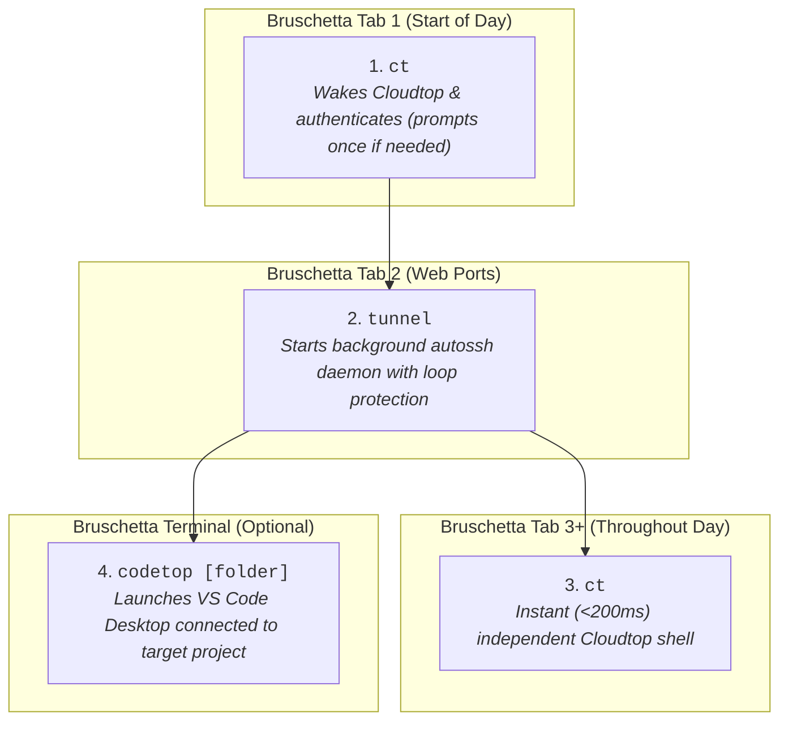

# Chromebook (Bruschetta) to Cloudtop Remote Development Setup

A personal configuration guide and copy-paste toolkit for working productively from a **Chromebook (ChromeOS / Bruschetta gLinux VM)** connected to **Google Cloudtop**.

> [!NOTE]
> This is a personal setup designed to maximize daily developer productivity and eliminate SSH/tunnel friction. While it works reliably for my workflow, it has not yet been broadly tested across all team configurations.

---

## 0. Prerequisites

Before setting up this workflow, ensure you have:

* **Bruschetta VM:** Managed gLinux virtual machine on ChromeOS ([go/bruschetta](http://go/bruschetta)).
* **Google Cloudtop Workstation:** Provisioned and accessible ([go/cloudtop](http://go/cloudtop)).
* **Security Key (Titan Key / FIDO2):** Authenticated for SSO and CorpSSH ([go/sk](http://go/sk)).
* **`roadwarrior` (`rw`):** Standard remote access utility ([go/roadwarrior](http://go/roadwarrior)).
* **`autossh`:** Port-forwarding daemon installed in Bruschetta:
  ```bash
  sudo apt install -y autossh
  ```
* **VS Code Desktop (Optional):** Installed inside Bruschetta ([go/vscode](http://go/vscode)).

---

## 1. Goals, Requirements & Scope

### Core Requirements (What this Setup Solves)
* **Dual Environment Productivity:** Work seamlessly both locally in Bruschetta and remotely on Cloudtop.
* **Remote Web App Access:** Run web apps, staging APIs, or Jupyter/Colab servers on Cloudtop (e.g. ports `9000`, `9090`, `8888`) and interact with them immediately in your Chromebook browser via `http://localhost:<PORT>`.
* **Flexible AI Tooling & Rapid Response:** Run **Jetski** remotely on Cloudtop or **Antigravity / VS Code** locally on your Chromebook for snappy, low-latency editing and rapid responsiveness.
* **Instant, Independent Terminal Tabs:** Open, work in, and close any number of fresh Cloudtop tabs in <200ms without state collision or port locks.
* **Single-Touch Morning Authentication:** Prevent runaway Titan Security Key popup loops (5–7+ prompts) and SSH key probing freezes.

### Out of Scope (Explicit Non-Goals)
* **Session Multiplexing & Connection Pooling:** Complex pooling tools like `shpool`, `tmux` socket forwarding, or OpenSSH `ControlMaster` socket sharing are intentionally excluded. They create socket deadlocks when laptops sleep or disconnect, permanently locking ports with `Address already in use`.

---

## 2. Directory Structure

```text
ce_chromebox_setup/
├── README.md                          # Comprehensive guide, visual diagrams, and troubleshooting
│
├── chromebook/                        # --- Files for Chromebook (Bruschetta VM) ---
│   ├── ssh_config.template            # ~/.ssh/config template (no multiplexing, IdentitiesOnly)
│   └── bashrc_additions.sh            # ~/.bashrc snippet (smart ct, tunnel daemon, codetop, optional theme)
│
└── cloudtop/                          # --- Files for Cloudtop Workstation ---
    ├── bashrc_additions.sh            # ~/.bashrc snippet (optional purple cloud theme & login banner)
    └── tunnel-shell                   # Helper script for ChromeOS native Terminal SWA
```

---

## 3. Daily Workflow (TL;DR)

All daily commands are executed in your **Bruschetta terminal**:



### The Step-by-Step Routine

| Step | Location | Command | Description |
| :--- | :--- | :--- | :--- |
| **1. Morning Connect & Auth** | Bruschetta Tab 1 | `ct` | Auto-detects credential state. Prompts once for password/security key if expired, wakes Cloudtop, and opens your primary shell. |
| **2. Start Web Ports** | Bruschetta Tab 2 | `tunnel` | Launches background `autossh` daemon with loop protection (`AUTOSSH_MAXSTART=1`). Connects silently with verified credentials. |
| **3. Open More Shell Tabs** | New Bruschetta Tabs | `ct` | Opens additional fresh, independent SSH tabs on Cloudtop in <200ms. |
| **4. Open VS Code** | Bruschetta Tab | `codetop [project]` | Launches VS Code connected to targeted project folder (avoids root `$HOME` file-watcher overload). |

### Tunnel Management Commands (Run in Bruschetta)

| Task | Command | Expected Output |
| :--- | :--- | :--- |
| **Start Tunnel** | `tunnel` | Authenticates via `rw`, starts daemon $\rightarrow$ `✅ Background tunnel active` |
| **Check Status** | `tunnel-status` | Displays running `autossh` PID and command line. |
| **Stop Tunnel** | `tunnel-stop` | `🛑 Tunnel stopped` |
| **Restart Tunnel** | `tunnel-restart` | Stops and restarts the background daemon. |

---

## 4. Setup Walkthrough

Setup is divided into two straightforward copy-paste parts:

---

### Part 1: On your Chromebook (Inside Bruschetta VM)

#### Step 1: Configure `~/.ssh/config`
Open `~/.ssh/config` in Bruschetta:
```bash
nano ~/.ssh/config   # or your preferred editor
```
Copy and paste the template from [`chromebook/ssh_config.template`](chromebook/ssh_config.template), replacing `<CLOUDTOP_NAME>` and `<LDAP_USERNAME>` with your details:

```sshconfig
##### Primary Cloudtop Host (Clean, Independent Shell Sessions & VS Code)
Host <CLOUDTOP_NAME>.c.googlers.com <CLOUDTOP_NAME> cloudtop ct
  HostName <CLOUDTOP_NAME>.c.googlers.com
  User <LDAP_USERNAME>
  AddressFamily inet
  IdentitiesOnly yes

##### Dedicated Background Tunnel Host (Web Dev & Colab Ports)
Host cloudtop-tunnel
  HostName <CLOUDTOP_NAME>.c.googlers.com
  User <LDAP_USERNAME>
  AddressFamily inet
  ExitOnForwardFailure yes
  IdentitiesOnly yes
  LocalForward 9000 127.0.0.1:9000
  LocalForward 9090 127.0.0.1:9090
  LocalForward 9900 127.0.0.1:9900
  LocalForward 8888 127.0.0.1:8888
  LocalForward 5387 127.0.0.1:5387

##### GitHub
Host github.com
  IdentitiesOnly yes
  AddKeysToAgent yes

##### Global Defaults (No Multiplexing, Optimized WebSocket KeepAlive)
Host *
  TCPKeepAlive no
  ServerAliveInterval 15
  ServerAliveCountMax 3
  ConnectTimeout 30
  ConnectionAttempts 3
  ForwardX11 no
```

#### Step 2: Add Functions & Aliases to `~/.bashrc`
Append the contents of [`chromebook/bashrc_additions.sh`](chromebook/bashrc_additions.sh) to your Bruschetta `~/.bashrc`.

> [!TIP]
> **Note on Visual Styling (Optional):** The first line (`PS1=...`) sets a distinctive green laptop badge (`💻 bruschetta:~$`) and dynamic tab titles to help you distinguish local tabs from remote Cloudtop tabs. If you prefer your existing prompt, feel free to omit that line.

```bash
# --- Visual Styling (Optional: Green Laptop Theme & Tab Title) ---
PS1='\[\e]0;💻 Bruschetta: \w\a\]\[\033[01;32m\]💻 bruschetta\[\033[00m\]:\[\033[01;34m\]\w\[\033[00m\]\$ '

# --- VS Code Remote on Cloudtop (Defaults to ~/dev) ---
unalias codetop 2>/dev/null || true
codetop() {
  local target="${1:-/usr/local/google/home/$USER/dev}"
  if [[ "$target" != /* ]]; then
    target="/usr/local/google/home/$USER/dev/$target"
  fi
  code --remote ssh-remote+cloudtop "$target"
}

# --- Smart Cloudtop Connect (Auto-Auth via Roadwarrior) ---
unalias ct 2>/dev/null || true
ct() {
  if command -v gcertstatus >/dev/null 2>&1 && ! gcertstatus --check_ssh_certs >/dev/null 2>&1; then
    echo "🔑 Morning credentials expired. Authenticating via roadwarrior..."
    rw --check_remaining --check_remaining_duration=8h --remote_gcertstatus_args="--check_remaining=8h" cloudtop "$@"
  else
    ssh cloudtop "$@"
  fi
}

alias rw='rw --check_remaining --check_remaining_duration=8h --remote_gcertstatus_args="--check_remaining=8h"'

# --- Background Port Tunnel Management (With Auto-Auth & Loop Protection) ---
alias tunnel='AUTOSSH_MAXSTART=1 rw --nossh_interactively --check_remaining --check_remaining_duration=8h --remote_gcertstatus_args="--check_remaining=8h" cloudtop && AUTOSSH_MAXSTART=1 autossh -M 0 -f -N cloudtop-tunnel && echo "✅ Background tunnel active (ports 9000, 9090, 9900, 8888, 5387)"'
alias tunnel-status='pgrep -fa "autossh.*cloudtop-tunnel" || echo "❌ Tunnel is not running"'
alias tunnel-stop='pkill -f "autossh.*cloudtop-tunnel" && echo "🛑 Tunnel stopped"'
alias tunnel-restart='tunnel-stop; sleep 1; tunnel'
```
Reload with `source ~/.bashrc`.

---

### Part 2: On your Cloudtop Workstation (Optional)

#### Step 1: Visual Prompt & Banner (Optional)
To visually distinguish remote Cloudtop shells from local Chromebook shells, connect to Cloudtop (`ct`) and optionally append [`cloudtop/bashrc_additions.sh`](cloudtop/bashrc_additions.sh) to `~/.bashrc` on Cloudtop:

```bash
# --- Cloudtop Visual Styling (Optional: Purple Cloud Theme + Banner) ---
PS1='\[\e]0;☁️ Cloudtop: \w\a\]\[\033[01;35m\]☁️  \h\[\033[00m\]:\[\033[01;34m\]\w\[\033[00m\]\$ '

if [[ -z "$VIRTUAL_ENV" && -t 1 ]]; then
  echo -e "\033[1;35m┌────────────────────────────────────────────────────┐\033[0m"
  echo -e "\033[1;35m│\033[0m  \033[1;37m☁️  CONNECTED TO GOOGLE CLOUDTOP (\h)\033[0m \033[1;35m│\033[0m"
  echo -e "\033[1;35m└────────────────────────────────────────────────────┘\033[0m"
fi
```
Reload with `source ~/.bashrc`.

#### Step 2: ChromeOS Native Terminal SWA Helper (Optional)
If you use native ChromeOS Terminal links (without Bruschetta), copy [`cloudtop/tunnel-shell`](cloudtop/tunnel-shell) to `~/bin/tunnel-shell` on Cloudtop:
```bash
mkdir -p ~/bin
cp cloudtop/tunnel-shell ~/bin/tunnel-shell
chmod +x ~/bin/tunnel-shell
```

---

## 5. Port Forwarding Directory

| Port | Service | Access URL | Notes |
| :--- | :--- | :--- | :--- |
| **`9000`** | Primary Web App / Dev Server | `http://localhost:9000` | Main local debugging port. |
| **`9090`** | Secondary Web App / API | `http://localhost:9090` | Secondary dev service. |
| **`9900`** | Tertiary Web App / Worker | `http://localhost:9900` | Additional staging/test service. |
| **`8888`** | Google Colab Local Runtime / Jupyter | `http://localhost:8888` | Connects browser Colab notebook to Cloudtop execution kernel. |
| **`5387`** | Jetski Hub Server | `http://jetski/?box=<CLOUDTOP_NAME>`<br>*(or `http://localhost:5387`)* | Primary access via ÜberProxy; local port forwarded as fallback. |

---

## 6. Native ChromeOS Terminal Links (No Bruschetta VM Needed)

If you need instant terminal access directly in ChromeOS without starting the Bruschetta VM:
* **Command Box:** (ChromeOS Terminal already includes `ssh `, so do not type `ssh`):
  ```text
  <USER>@<CLOUDTOP_NAME>.c.googlers.com -L 9000:localhost:9000 -L 9090:localhost:9090 -L 9900:localhost:9900 -L 8888:localhost:8888 -o ServerAliveInterval=15 -o ServerAliveCountMax=3 -t ~/bin/tunnel-shell
  ```
* **SSH relay server options:** `--config=google`

---

## 7. Troubleshooting Runbook

### Issue 1: Multiple Security Key Popups in a Row
* **Cause:** `autossh` was launched in the background before credentials were valid, or `IdentitiesOnly yes` is missing.
* **Fix:**
  ```bash
  pkill -9 -f autossh; pkill -9 -f cloudtop-tunnel
  ```
  Ensure `IdentitiesOnly yes` is present in `~/.ssh/config` and run `ct` first to authenticate in the foreground.

### Issue 2: Port Locked (`Address in use`)
* **Cause:** A previous hung SSH process is still listening on port 9000 or 8888.
* **Fix:**
  ```bash
  sudo kill -9 $(lsof -t -i :9000 -i :8888) 2>/dev/null || true
  tunnel-restart
  ```

### Issue 3: `Connection closed by UNKNOWN port 65535`
* **Cause:** SSO master cookie expired.
* **Fix:** Run `ct` to trigger roadwarrior authentication.
