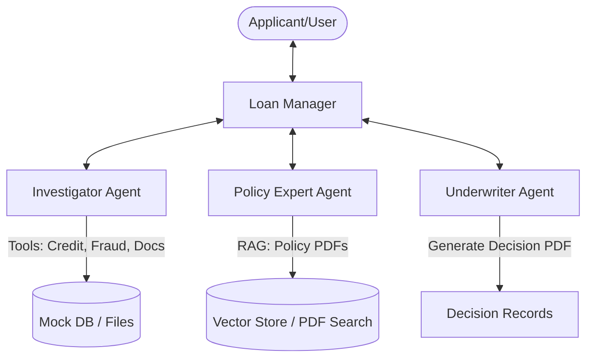

# Loan Approval Agent

A specialized AI agent system that automates the loan underwriting process using a multi-agent architecture. This project demonstrates how to use the [Google Cloud Agent Development Kit (ADK)](https://github.com/GoogleCloudPlatform/google-cloud-adk) to build a complex, regulated workflow with specialized agents.

## Overview

The Loan Approval Agent decomposes the underwriting process into three distinct roles, orchestrated by a central manager:

1.  **Loan Manager (Orchestrator)**: Coordinates the entire workflow, manages state, and interacts with the user.
2.  **Investigator Agent**: Gathers factual data about the applicant (Credit Reports, Employment Verification, Fraud Checks, Document Analysis).
3.  **Policy Expert Agent**: Retrieves and interprets specific lending guidelines from policy documents (PDFs) using RAG (Retrieval Augmented Generation).
4.  **Underwriter Agent**: Synthesizes findings from the Investigator and Policy Expert to make a final Approve/Deny/Escalate decision and generates a formal decision record.

## Architecture



## Features

-   **Multi-Agent Collaboration**: distinct personas with specialized tools.
-   **Document Upload**: Support for parsing and analyzing uploaded Payslips and Bank Statements (Simulated).
-   **Policy RAG**: "Consult Policy" tool that reads from real PDF policy documents (`Master_Lending_Policy_v2024.pdf`).
-   **Audit Logging**: Detailed JSON audit logs for every decision and agent action.
-   **Human-in-the-Loop**: Escalation mechanisms for borderline cases.
-   **Configurable Latency**: Toggle between "Realistic" (simulating API delays) and "Testing" (instant) modes.

## Getting Started

### Prerequisites

-   Python 3.12+
-   `uv` (for dependency management)
-   Google Cloud Project with Vertex AI enabled

### Installation

1.  **Clone the repository**:
    ```bash
    git clone <repository_url>
    cd loan-approval-agent
    ```

2.  **Install dependencies**:
    ```bash
    uv sync
    ```

3.  **Set up Environment**:
    Create a `.env` file (or set in your shell):
    ```ini
    GOOGLE_CLOUD_PROJECT=your-project-id
    VERTEXAI_LOCATION=us-central1
    # MODEL_FLASH=gemini-2.5-flash (Optional override)
    # LATENCY_MODE=REALISTIC (or TESTING)
    ```

### Running the Demo

#### 1. Command Line Interface (CLI)
Run the agent interactively in your terminal:
```bash
uv run loan_approval_agent/agent.py
```

#### 2. Streamlit Web App (Recommended)
Launch the interactive demo dashboard:
```bash
uv run streamlit run demo_app.py
```
-   **Sidebar**: Configure Applicant ID (Mock), Loan Amount, and Latency Mode.
-   **Uploads**: Upload sample PDF documents (Payslips/Bank Statements) to test document analysis.
-   **Trace**: Watch the agent conversation and "Thought Process" in real-time.

## Mock Data & Scenarios

The system uses local mock data to ensure reliability and repeatability.

-   **Applicants**: Pre-defined profiles in `loan_approval_agent/data/mock_db/applicants.json`.
    -   `12345`: "John Doe" - Perfect Candidate (Auto-Approve).
    -   `12348`: "Jordan Lee" - Borderline Credit (Escalation Test).
    -   `9813ee1d`: "Alice Smith" - High Risk (Auto-Decline).
-   **Documents**: Mock generated PDFs in `artifacts/uploads/`.

## Running Tests

Run the test suite to verify functionality:

```bash
uv run pytest
```
*Note: Some tests may be skipped due to runtime mocking complexities.*

## Deployment

Deploy the agent to Vertex AI Reasoning Engine:

```bash
uv run deployment/deploy.py --create
```

## License

Apache 2.0
