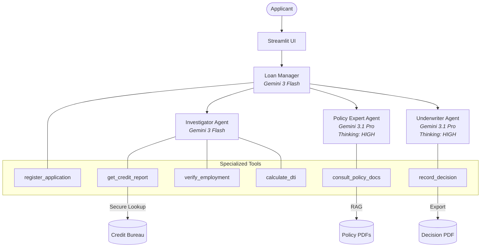

# Loan Approval Agent

A specialized AI agent system that automates the loan underwriting process using a multi-agent architecture. This project demonstrates how to use the [Google Cloud Agent Development Kit (ADK)](https://github.com/GoogleCloudPlatform/google-cloud-adk) to build a complex, regulated workflow with specialized agents.

## Overview

The Loan Approval Agent decomposes the underwriting process into three distinct roles, orchestrated by a central manager:

1.  **Loan Manager (Orchestrator)**: [Gemini 3 Flash] Coordinates the entire workflow, manages state, and interacts with the user.
2.  **Investigator Agent**: [Gemini 3 Flash] Gathers factual data about the applicant (Credit Reports, Employment Verification, Fraud Checks, Document Analysis).
3.  **Policy Expert Agent**: [Gemini 3.1 Pro - Thinking: HIGH] Retrieves and interprets specific lending guidelines from policy documents (PDFs) using RAG (Retrieval Augmented Generation).
4.  **Underwriter Agent**: [Gemini 3.1 Pro - Thinking: HIGH] Synthesizes findings from the Investigator and Policy Expert to make a final Approve/Deny/Escalate decision.

## Architecture



## Features

-   **Multi-Agent Collaboration**: distinct personas with specialized tools.
-   **Real ID Architecture**: Uses realistic Government IDs (e.g., SSN) for strict data lookups and validation.
-   **Document Upload**: Support for parsing and analyzing uploaded Payslips and Bank Statements (Simulated).
-   **Policy RAG**: "Consult Policy" tool that reads from real PDF policy documents (`Master_Lending_Policy_v2024.pdf`).
-   **Audit Logging**: Detailed JSON audit logs for every decision and agent action.
-   **Human-in-the-Loop**: Escalation mechanisms for borderline cases.
-   **Configurable Latency**: Toggle between "Realistic" (simulating API delays) and "Testing" (instant) modes.

## Getting Started

### Prerequisites

-   Python 3.12+
-   `uv` (for dependency management)
-   Google Cloud Project with Vertex AI enabled

### Installation

1.  **Clone the repository**:
    ```bash
    git clone <repository_url>
    cd loan-approval-agent
    ```

2.  **Install dependencies**:
    ```bash
    uv sync
    ```

3.  **Set up Environment**:
    Create a `.env` file (or set in your shell):
    ```ini
    GOOGLE_CLOUD_PROJECT=your-project-id
    VERTEXAI_LOCATION=us-central1
    # MODEL_FLASH=gemini-2.5-flash (Optional override)
    # LATENCY_MODE=REALISTIC (or TESTING)
    ```

### Running the Demo

#### 1. Command Line Interface (CLI)
Run the agent interactively in your terminal:
```bash
uv run loan_agent/agent.py
```

#### 2. Streamlit Web App (Recommended)
Launch the interactive demo dashboard:
```bash
uv run streamlit run demo_frontend/app.py
```
**[📜 View the Full Demo Script (DEMO.md)](docs/DEMO.md)**

-   **Sidebar**: Configure Applicant ID (Mock), Loan Amount, and Latency Mode.
-   **Uploads**: Upload sample PDF documents (Payslips/Bank Statements) to test document analysis.
-   **Trace**: Watch the agent conversation and "Thought Process" in real-time.

## Project Documentation

-   [**Demo Script**](docs/DEMO.md): Step-by-step guide for presenting the agent.
-   [**Implementation Plan**](docs/IMPLEMENTATION_PLAN.md): Technical details of the resilience and "Real ID" architecture.
-   [**Interview Task**](docs/interview_task.txt): Original requirements and problem statement.

## Mock Data & Scenarios

The system uses local mock data to ensure reliability and repeatability.

-   **Applicants**: Pre-defined profiles in `loan_agent/data/demo_data/applicants.json`.
    -   `900-00-1234`: "Sarah Speed" - Perfect Candidate (Auto-Approve) or High DTI (Decline).
    -   `900-00-3456`: "Gary Escalate" - Borderline Credit (Escalation Test).
    -   `900-00-9999`: "Jane Fraud" - Data Inconsistency (Fraud Detection).
    -   `000-00-0000`: "Alex Resilience" - Invalid ID (Resilience Test).

-   **Documents**: Mock generated PDFs in `artifacts/uploads/`.
    -   **Pay Stubs**: Realistic pay stubs generated using Gemini (e.g., `pay_stub_sarah_speed.pdf`) with consistent addresses and deductions.
-   **Diagrams**: Updated architecture and flow diagrams in `docs/` now explicitly show the **Human-in-the-Loop (HIL)** handoff process.

## Running Tests

Run the test suite to verify functionality:

```bash
uv run pytest
```
*Note: Some tests may be skipped due to runtime mocking complexities.*

## Troubleshooting

### SyntaxWarnings
If you see `SyntaxWarning: invalid escape sequence '\$'`, it means Python is interpreting the backslash in an f-string incorrectly.
**Fix**: Use double backslashes `\\$` to escape the dollar sign in f-strings.

### Streamlit Hangs
If the agent traces stop appearing:
- The session might be stale. Click the "Rerun" or "Reload" button in the top right.
- Check the console for `Agent Error` or stack traces.

## Deployment

Deploy the agent to Vertex AI Reasoning Engine:

```bash
uv run deployment/deploy.py --create
```

## License

Apache 2.0

## TODO

- [ ] **Fix CLI Mode**: `loan_approval_agent/agent.py` is missing a `__main__` block and cannot be run interactively.
- [ ] **Resilience**: Verify `employment_service.py` handles missing/invalid IDs gracefully.

## Backlog / Future Improvements

- [ ] **Identity Verification (KYC)**:
    - Support Photo ID & Selfie upload.
    - Implement Vision-based matching (Gemini Multimodal).
- [ ] **Security Hardening**:
    - Automated Prompt Injection testing.
    - Cloud Armor integration for API endpoints.
    - **Data Protection**: Integrate Google Cloud DLP/SDP to automatically redact PII from logs and agent context.
- [ ] **Interactive Validation**:
    - Enhance Q&A strategies for ambiguous inputs.
