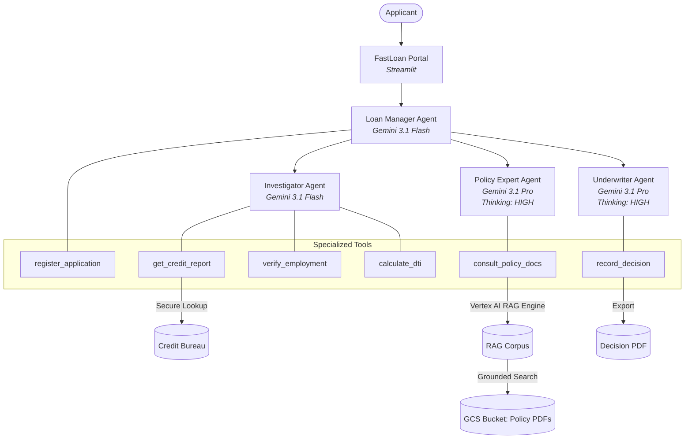

# Loan Approval Agent

A specialized AI agent system that automates the loan underwriting process using a multi-agent architecture. This project demonstrates how to use the [Google Cloud Agent Development Kit (ADK)](https://github.com/GoogleCloudPlatform/google-cloud-adk) to build a complex, regulated workflow with specialized agents.

## Overview

The Loan Approval Agent decomposes the underwriting process into three distinct roles, orchestrated by a central manager:

1.  **Loan Manager (Orchestrator)**: [Gemini 3.1 Flash] Coordinates the entire workflow, manages state, and interacts with the user.
2.  **Investigator Agent**: [Gemini 3.1 Flash] Gathers factual data about the applicant (Credit Reports, Employment Verification, Fraud Checks, Document Analysis).
3.  **Policy Expert Agent**: [Gemini 3.1 Pro - Thinking: HIGH] Retrieves and interprets specific lending guidelines from a 300+ page policy corpus using **Vertex AI RAG Engine** grounded in Google Cloud Storage.
4.  **Underwriter Agent**: [Gemini 3.1 Pro - Thinking: HIGH] Synthesizes findings from the Investigator and Policy Expert to make a final Approve/Deny/Escalate decision.

## Architecture



## Features

-   **Multi-Agent Collaboration**: Distinct personas with specialized tools managing a complex workflow.
-   **Cloud-Native RAG**: High-performance policy review using **Vertex AI RAG Engine** to cite hundreds of pages across multiple PDF documents stored in GCS.
-   **Security & DLP**: Automatic PII redaction in all audit logs using **Google Cloud DLP** (Sensitive Data Protection).
-   **Reasoning Trace**: A live, high-transparency "Audit Trace" in the UI showing every agent action and tool call.
-   **Human-in-the-Loop**: Seamless escalation to manual review for borderline or complex cases.
-   **Compliance Records**: Automated generation of formal Decision PDFs containing full audit trails.

## Getting Started

### Prerequisites

-   Python 3.12+
-   `uv` (for dependency management)
-   Google Cloud Project with Vertex AI and Cloud DLP enabled

### Installation

1.  **Clone the repository**:
    ```bash
    git clone <repository_url>
    cd loan-approval-agent
    ```

2.  **Install dependencies**:
    ```bash
    uv sync
    ```

### Running the Demo

#### 1. Streamlit Web App (Recommended)
Launch the interactive demo dashboard:
```bash
uv run streamlit run demo_frontend/app.py
```
**[📜 View the Full Demo Script (DEMO.md)](docs/DEMO.md)**

-   **Sidebar**: Select preset scenarios, copy prompts, and toggle latency modes.
-   **Audit Trace**: Watch the agent's internal reasoning and tool calls in real-time.
-   **Decision Record**: Download the final compliance artifact once the process completes.

## Mock Data & Scenarios

The system uses local mock data to ensure reliability and repeatability.

-   **Applicants**: Pre-defined profiles in `external_services/data/applicants.json`.
    -   `900-00-1234`: "Sarah Speed" - Perfect Candidate (Auto-Approve) or High DTI (Decline).
    -   `900-00-3456`: "Gary Escalate" - Borderline Credit (Escalation Test).
    -   `900-00-9999`: "Jane Fraud" - Data Inconsistency (Fraud Detection).
    -   `000-00-0000`: "Alex Resilience" - Invalid ID (Resilience Test).

-   **Policy Documents**: Stored in `external_services/confluence/` (Local) and mirrored in GCS for the RAG engine.
