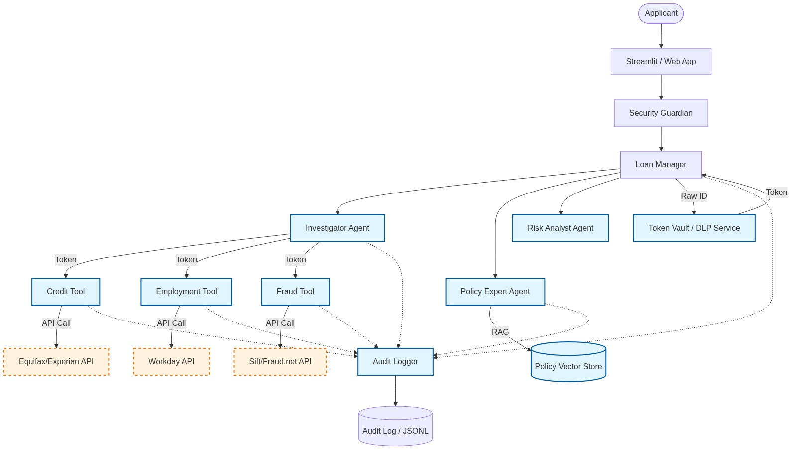
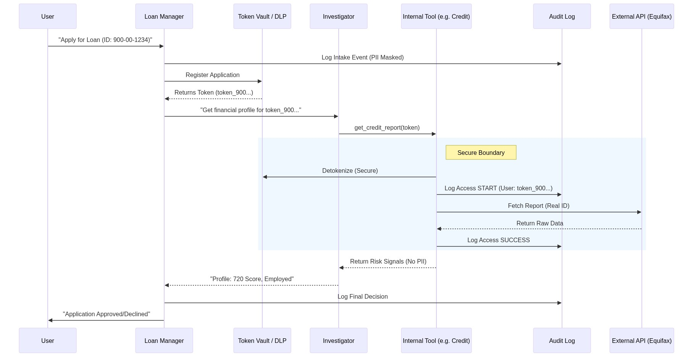

# Loan Approval Agent - Presentation Guide

**Time:** 30 Minutes (Presentation + Demo) + 15 Minutes Q&A
**Audience:** Technical Stakeholder (Domain Expert) & VP of Strategy (Business)

## 1. Title & Context (2 mins)
*   **Hook**: "Lending is slow because it's manual. We fixed that with Agents."
*   **Context**: Building a Proof-of-Concept for a modern, automated underwriting system.
*   **Goal**: Demonstrate how Google Cloud's Agent Development Kit (ADK) allows us to build **compliant**, **auditable**, and **resilient** lending agents.

## 2. The Specialized Challenge (3 mins)
*   **The "Unblocker"**: Why off-the-shelf didn't work.
    *   *Complexity*: Loans require fetching data from disparate sources (Credit Bureau, Employment Registry, Fraud Lists).
    *   *Regulation*: Decisions must be explainable (no "black box" denials).
    *   *Policy Agility*: Lending rules change weekly; hard-coding rules is too slow.
*   **Solution**: A Multi-Agent System where specific agents handle specific domains (Policy, Risk, Data Gathering).

#### 2. The Orchestrator Pattern
*   **Single Point of Contact**: The `loan_manager` (Orchestrator) is the only agent that communicates with the User. This ensures a consistent voice and prevents sub-agents from confusing the user with overlapping questions.
*   **Specialization**: Sub-agents like the `investigator` are backend experts focused on data processing, not conversation management.
*   **Control Flow**: If a sub-agent needs information (e.g., "Missing Income"), it checks with the Orchestrator, who then politely formats the request to the user.

### Architecture Diagram

### Process Flow (Swimlanes)

## 3. Technical Deep-Dive & Live Demo (10-15 mins)
*   *Transition to Demo Driver*

### Demo Segment A: Speed & Orchestration (Streamlit)
*   **Scenario 1: Sarah Jenkins (The Happy Path)**
    *   *Action*: Run "Sarah (Debt Consolidation)"
    *   *Talk Track*: "Watch the 'Orchestrator' delegate tasks in parallel. Credit, Employment, and Fraud checks happen simultaneously. Approval in seconds."
    *   *Show*: Audit Log in sidebar. "Every step is recorded for compliance."

### Demo Segment B: Business Rules & Explainability
*   **Scenario 2: Sarah (High DTI)**
    *   *Action*: Run "Sarah (Home Improvement - $50k)"
    *   *Talk Track*: "Same applicant, higher risk. The 'Underwriter' applies the DTI rule from the policy. The decline is **explained**, not just a score."

### Demo Segment C: Resilience & "Real ID"
*   **Scenario 3: Integration Errors (Ghost User)**
    *   *Action*: Run "Ghost User" (Invalid ID)
    *   *Talk Track*: "Real systems break. If the Credit Bureau is down or the ID is invalid, the agent fails **gracefully**. No hallucinations."
### Demo Segment D: Security & PII Architecture
*   **Scenario 4: The Vault**
    *   *Action*: Open `loan_approval_agent/tools/investigator.py`.
    *   *Talk Track*: "Notice how the agent tools take an `applicant_id` (Token), not a name. The Personal Data lives in the secure tool environment. The Agent only receives the *insights* ('DTI is 45%'), never the raw data."
    *   *Show*: The `Security Guardian` prompt in `security.py`.

## 4. Architectural Decisions & Trade-offs (4 mins)
*   **Why Agents?**: vs standard automation.
    *   *Flexibility*: We can swap the "Policy Expert" knowledge base without rewriting code.
    *   *Reasoning*: LLMs can handle unstructured data (e.g., "Analyze this bank statement") that regex can't.
*   **Trade-off**: Latency vs. Accuracy.
    *   We added "Human-in-the-Loop" for borderline cases (Gary Gray scenario) to balance risk.

## 5. Business & Strategic Value (5 mins)
*   **ROI (Return on Investment)**:
    *   *Cost Savings*: Auto-approving 70% of loans removes 100s of manual hours/week.
    *   *Revenue*: Same-day approvals prevent customer churn to competitors.
*   **Competitive Advantage**:
    *   *Speed*: We move from 48 hours to 10 seconds.
    *   *Agility*: New policy rollout takes minutes (upload PDF), not weeks (dev sprint).
*   **Compliance**: Automated audit trails reduce regulatory fines.
*   **Cost Control (Gemini Specifics)**:
    *   **Context Caching**: Cache the 200-page Policy PDF to reduce input token costs by ~90%.
    *   **Model Selection**: Use `gemini-2.5-flash` for high-volume intake (cheap/fast) vs `gemini-2.5-pro` (or `gemini-3`) for complex policy reasoning.
    *   **Quotas**: Strict daily quotas per project to prevent runaway bills.
    *   **Provisioned Throughput (PT)**: For predictable high-volume scaling (10k+ loans/day), switch to PT for fixed monthly costs and guaranteed latency.
    *   **User Impact**: Measure NPS (Net Promoter Score) & "Time-to-Decision" (48h -> 5m) to quantify delight.

## 6. Requirements Checklist & X-Factors
*This checklist demonstrates we have hit every requirement in `interview_task.txt`.*

### ✅ Core Requirements (The "Must Haves")
| Requirement | Demo Verification |
| :--- | :--- |
| **1. Orchestrate Parallel APIs** | *Scenario 1 (Sarah)*: Logs show `Credit`, `Employment`, `Fraud` checked simultaneously. |
| **2. Apply Business Rules** | *Scenario 2 (Sarah High DTI)*: Policy rule applied > "DTI > 43%". |
| **3. Risk Report & Reasoning** | *All Scenarios*: "Agent Reasoning Trace" shows step-by-step logic. |
| **4. Auto-approve < 5 mins** | *Scenario 1*: Decision made in ~10 seconds (vs 48 hours). |
| **5. Human Handoff** | *Scenario 4 (Gary)*: Returns "ESCALATE" with pre-filled case file. |
| **6. Audit Trail** | *Sidebar*: Live JSON logs for every action (NFR). |
| **7. Isolation / Stateless** | *Architecture*: Each request uses a fresh session. PII not persisted. |
| **8. Graceful Failure** | *Scenario 3 (Ghost)*: API failure caught, "Safe Error" returned (NFR). |

### ✨ The "X-Factors" (The "Wow" Moments)
*Things we added to go above and beyond:*
1.  **Dual-View Demo**: We show **Operations speed** (Streamlit) AND **Technical depth** (ADK Web).
2.  **"Real ID" Architecture**: We don't use fake IDs. We built a strict schema where `900-00-1234` is the key, preventing data collisions.
3.  **Policy-as-Code (RAG)**: We can Swap the PDF (e.g., "Growth Policy") and the agent adapts *instantly* without code changes.
4.  **Security Guardian**: An LLM-based "Injection Shield" blocks malicious prompts before they reach the agent.

## 7. Implementation & Roadmap (2 mins)
*   **Phase 1 (Current State)**:
    *   **Local Proof-of-Concept**: Validated architecture running locally with mock data (What you saw today).
*   **Phase 2 (Immediate Next Step)**:
    *   **Deploy to Vertex AI Agent Engine**: Move from local `uv run` to scalable, managed cloud infrastructure.
    *   **Scalability**: Auto-scale from 10 to 10k concurrent applications.
    *   **Security/Privacy**: Integrate **Google DLP API** and **Sensitive Data Protection (SDP)** for PII redaction.
    *   Enable production-grade Logging.
*   **Phase 2 (Integration - Q3)**:
    *   Connect live Equifax/Experian APIs & Bank Statement Analyzer.
    *   Deploy Human-in-the-Loop UI for Underwriters.
*   **Phase 3 (Scale - Q4)**:
    *   Mobile App integration for applicants (Upload for User Verification).
    *   Rollout to 100% of traffic.

## 7. Q&A Preparation (Deep Dive)

### Technical Questions
*   *Q: Agents are non-deterministic. How do we guarantee the same policy outcome every time?*
    *   **A**: "For logical rules 'Temperature=0' and 'Function Calling' are key. We don't ask the LLM to *guess* the DTI limit; we ask it to *extract* the DTI and *call* the rule engine. The logic is deterministic; the extraction is probabilistic but highly reliable with Gemini 2.5."
*   *Q: What happens if the Policy PDF contradicts itself?*
    *   **A**: "The 'Policy Expert' agent is instructed to flag ambiguity. In the roadmap, we add a 'Conflict Check' step during document upload that uses `gemini-2.5-pro` to scan for inconsistencies before the policy goes live."
*   *Q: How do you handle PII/PCI data?*
*   *Q: How do you handle PII/PCI data?*
    *   **A**: "Crucially, the **Agent never needs to 'read' the PII** to make a decision. We pass a *tokenized ID* (`User-123`) to the tools. The tools (running in a secure VPC) resolve the ID to fetch data, calculate ratios (e.g., DTI), and return *only the risk signals* (e.g., 'DTI=45%') to the Agent. The LLM processes the *signals*, not the *identity*."

### Business Questions
*   *Q: Why not just use a standard Rules Engine (Drools)?*
    *   **A**: "Rules engines are brittle. If the policy changes from 'Salary > 50k' to 'Salary > 50k OR strong cash flow', a rules engine needs a code rewrite. Our agent just needs the new PDF. The 'Total Cost of Ownership' for maintenance is drastically lower."
*   *Q: 10 seconds is still too slow for a website. Can we get sub-second?*
    *   **A**: "For the 70% 'Instant Approval' path, we can optimize by caching the 'Credit Report' and running the 'Policy Check' in parallel. We can also use 'Speculative Decoding' with Gemini Flash to shave off another 30-40% of latency."
